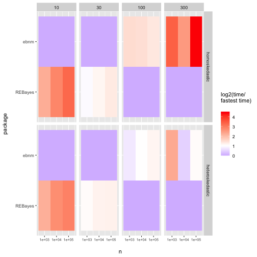

```r
###### HANDLE ARGS ----------------------------------------------------

args <- commandArgs(trailingOnly = TRUE)

valid.args <- args %in% c(
  "out-to-file",
  "test",
  "full"
)
if (!all(valid.args)) {
  stop("Command line argument ",
       min(which(!valid.args)),
       " not recognized.")
}

test <- "test" %in% args
full <- "full" %in% args

if ("out-to-file" %in% args) {
  fname <- "../output/code_output"
  if (test) {
    fname <- paste0(fname, "_test")
  }
  out_file <- file(paste0(fname, ".txt"), open = "wt")
  sink(out_file)
  sink(out_file, type = "message")
}

# system("if [ ! -d ../figs ]; then mkdir ../figs; fi")


###### REQUIRED PACKAGES ----------------------------------------------

library("tidyverse")
```

```
## ── Attaching core tidyverse packages ─────────────────────────────────────────────── tidyverse 2.0.0 ──
## ✔ dplyr     1.1.4     ✔ readr     2.1.5
## ✔ forcats   1.0.0     ✔ stringr   1.5.1
## ✔ ggplot2   3.5.0     ✔ tibble    3.2.1
## ✔ lubridate 1.9.3     ✔ tidyr     1.3.0
## ✔ purrr     1.0.2     
## ── Conflicts ───────────────────────────────────────────────────────────────── tidyverse_conflicts() ──
## ✖ dplyr::filter() masks stats::filter()
## ✖ dplyr::lag()    masks stats::lag()
## ℹ Use the conflicted package (<http://conflicted.r-lib.org/>) to force all conflicts to become errors
```

```r
library("ebnm")
library("flashier")
```

```
## Loading required package: magrittr
## 
## Attaching package: 'magrittr'
## 
## The following object is masked from 'package:purrr':
## 
##     set_names
## 
## The following object is masked from 'package:tidyr':
## 
##     extract
```

```r
library("gt")
library("cowplot")
```

```
## 
## Attaching package: 'cowplot'
## 
## The following object is masked from 'package:lubridate':
## 
##     stamp
```

```r
# Also needed: microbenchmark, scales, Rtsne, ggrepel, cowplot


###### INTRODUCTION ---------------------------------------------------

# Run simulation from shrink_intro.Rmd vignette.
set.seed(1)
n <- 400
u <- 2 + (runif(n) < 0.2) * rnorm(n)
s <- rep(1/3, n)
x <- u + s * rnorm(n)

# Fit EBNM models.
fit_normal <- ebnm(x, s, prior_family = "normal", mode = "estimate")
fit_pn <- ebnm(x, s, prior_family = "point_normal", mode = "estimate")

# Compile the results needed to generate the plots.
pdat <- data.frame(u      = u,
                   mle    = x,
                   est.n  = coef(fit_normal),
                   est.pn = coef(fit_pn))

# Plot true mean vs. MLE.
lims <- c(-0.55, 5.05)
p1 <- ggplot(pdat, aes(x = u, y = mle)) +
  geom_point() +
  geom_abline(intercept = 0, slope = 1, color = "magenta", linetype = "dotted") +
  labs(x = "true value",
       y = "estimate",
       title = "MLE",
       subtitle = sprintf("RMSE = %0.3f", sqrt(mean((x - u)^2)))) +
  xlim(lims) +
  ylim(lims) +
  theme_cowplot(font_size = 12) +
  theme(plot.title = element_text(face = "plain", size = 11),
        plot.subtitle = element_text(face = "plain", size = 10))

# Plot true mean vs. posterior estimate from fit_normal.
p2 <- ggplot(pdat, aes(x = u, y = est.n)) +
  geom_point() +
  geom_abline(intercept = 0, slope = 1, color = "magenta", linetype = "dotted") +
  labs(x = "true value ",
       y = "estimate",
       title = "EB with normal prior",
       subtitle = sprintf("RMSE = %0.3f", sqrt(mean((coef(fit_normal) - u)^2)))) +
  xlim(lims) +
  ylim(lims) +
  theme_cowplot(font_size = 12) +
  theme(plot.title = element_text(face = "plain", size = 11),
        plot.subtitle = element_text(face = "plain", size = 10))

# Plot true mean vs. posterior estimate from fit_pn.
p3 <- ggplot(pdat, aes(x = u, y = est.pn)) +
  geom_point() +
  geom_abline(intercept = 0, slope = 1, color = "magenta", linetype = "dotted") +
  labs(x = "true value ",
       y = "estimate",
       title = "EB with point-normal prior",
       subtitle = sprintf("RMSE = %0.3f", sqrt(mean((coef(fit_pn) - u)^2)))) +
  xlim(lims) +
  ylim(lims) +
  theme_cowplot(font_size = 12) +
  theme(plot.title = element_text(face = "plain", size = 11),
        plot.subtitle = element_text(face = "plain", size = 10))

ggsave("../figs/shrink_intro.pdf",
       plot_grid(p1, p2, p3, nrow = 1, ncol = 3),
       height = 2.75, width = 7)


###### TIMING STUDY ---------------------------------------------------

cat("\nTIMING STUDY...\n\n")
```

```
## 
## TIMING STUDY...
```

```r
#### Run simulations ----

set.seed(666)

if (exists("test") && test) {
  ns <- 10^seq(2, 3, by = 0.5)
  mb_times <- rep(2, length(ns))
  fname_suffix <- "_test"
} else if (exists("full") && full) {
  ns <- 10^seq(2, 6, by = 0.5)
  mb_times <- rep(20, length(ns))
  fname_suffix <- "_full"
} else {
  ns <- 10^seq(2, 4, by = 0.5)
  mb_times <- rep(20, length(ns))
  fname_suffix <- ""
}

cat(paste0("\nTiming different prior families.\n",
           "  n ranges from ", min(ns), " to ", max(ns), ".\n\n"))
```

```
## 
## Timing different prior families.
##   n ranges from 100 to 10000.
```

```r
# Mixture of point mass at zero and t_5
point_t <- function(n) {
  samp <- 1.5 * rt(n, df = 5)
  samp <- samp * sample(c(0, 1), n, replace = TRUE, prob = c(0.5, 0.5))
  return(samp + rnorm(n))
}

ebnm_fns <- c("ebnm_normal",
              "ebnm_point_normal",
              "ebnm_point_laplace",
              "ebnm_normal_scale_mixture",
              "ebnm_unimodal_symmetric",
              "ebnm_unimodal",
              "ebnm_deconvolver",
              "ebnm_npmle",
              "ebnm_horseshoe")

t_begin <- Sys.time()
res <- tibble()
for (i in 1:length(ns)) {
  n <- ns[i]
  cat("  n:", n, "\n")

  x <- point_t(n)

  test_fns <- ebnm_fns

  mb_tests <- lapply(test_fns, function(fn) {
    bquote(do.call(.(fn), list(x = x, s = 1)))
  })

  mb_res <- microbenchmark::microbenchmark(
    list = mb_tests,
    times = mb_times[i]
  )

  res <- res %>%
    bind_rows(
      tibble(mb_res) %>%
        mutate(expr = str_extract(expr, "ebnm.+\\\"")) %>%
        mutate(expr = str_remove(expr, "\\\"")) %>%
        mutate(n = n)
    )
}
```

```
##   n: 100
```

```
## Warning in microbenchmark::microbenchmark(list = mb_tests, times = mb_times[i]): less accurate
## nanosecond times to avoid potential integer overflows
```

```
##   n: 316.2278
```

```
## Warning in stats::nlm(f = loglik, p = aStart, gradtol = 1e-10, ...): NA/Inf replaced by maximum
## positive value
```

```
## Warning in stats::nlm(f = loglik, p = aStart, gradtol = 1e-10, ...): NA/Inf replaced by maximum
## positive value

## Warning in stats::nlm(f = loglik, p = aStart, gradtol = 1e-10, ...): NA/Inf replaced by maximum
## positive value

## Warning in stats::nlm(f = loglik, p = aStart, gradtol = 1e-10, ...): NA/Inf replaced by maximum
## positive value

## Warning in stats::nlm(f = loglik, p = aStart, gradtol = 1e-10, ...): NA/Inf replaced by maximum
## positive value

## Warning in stats::nlm(f = loglik, p = aStart, gradtol = 1e-10, ...): NA/Inf replaced by maximum
## positive value

## Warning in stats::nlm(f = loglik, p = aStart, gradtol = 1e-10, ...): NA/Inf replaced by maximum
## positive value

## Warning in stats::nlm(f = loglik, p = aStart, gradtol = 1e-10, ...): NA/Inf replaced by maximum
## positive value

## Warning in stats::nlm(f = loglik, p = aStart, gradtol = 1e-10, ...): NA/Inf replaced by maximum
## positive value

## Warning in stats::nlm(f = loglik, p = aStart, gradtol = 1e-10, ...): NA/Inf replaced by maximum
## positive value

## Warning in stats::nlm(f = loglik, p = aStart, gradtol = 1e-10, ...): NA/Inf replaced by maximum
## positive value

## Warning in stats::nlm(f = loglik, p = aStart, gradtol = 1e-10, ...): NA/Inf replaced by maximum
## positive value

## Warning in stats::nlm(f = loglik, p = aStart, gradtol = 1e-10, ...): NA/Inf replaced by maximum
## positive value

## Warning in stats::nlm(f = loglik, p = aStart, gradtol = 1e-10, ...): NA/Inf replaced by maximum
## positive value

## Warning in stats::nlm(f = loglik, p = aStart, gradtol = 1e-10, ...): NA/Inf replaced by maximum
## positive value

## Warning in stats::nlm(f = loglik, p = aStart, gradtol = 1e-10, ...): NA/Inf replaced by maximum
## positive value

## Warning in stats::nlm(f = loglik, p = aStart, gradtol = 1e-10, ...): NA/Inf replaced by maximum
## positive value

## Warning in stats::nlm(f = loglik, p = aStart, gradtol = 1e-10, ...): NA/Inf replaced by maximum
## positive value

## Warning in stats::nlm(f = loglik, p = aStart, gradtol = 1e-10, ...): NA/Inf replaced by maximum
## positive value

## Warning in stats::nlm(f = loglik, p = aStart, gradtol = 1e-10, ...): NA/Inf replaced by maximum
## positive value
```

```
##   n: 1000 
##   n: 3162.278 
##   n: 10000
```

```r
t_elapsed <- Sys.time() - t_begin
cat("  Done. Time elapsed:",
    round(as.numeric(t_elapsed, units = "mins"), 1), "minutes.\n")
```

```
##   Done. Time elapsed: 5.4 minutes.
```

```r
res <- res %>%
  mutate(expr = fct_relevel(expr, rev(ebnm_fns)))

saveRDS(res, paste0("../output/timecomps", fname_suffix, ".rds"))

#### Create figure ----

summary_res <- res %>%
  mutate(time = time / 1e9) %>%
  group_by(n, expr) %>%
  summarize(
    mean = mean(time),
    lowerq = quantile(time, probs = 0.1),
    upperq = quantile(time, probs = 0.9)
  )
```

```
## `summarise()` has grouped output by 'n'. You can override using the `.groups` argument.
```

```r
lvls <- summary_res %>%
  filter(n == ns[8]) %>%
  arrange(-mean) %>%
  pull(expr) %>%
  as.character()

summary_res <- summary_res %>%
  mutate(expr = fct_relevel(expr, lvls)) %>%
  mutate(expr = fct_relabel(expr, ~ str_remove(., "ebnm_")))

ggplot(summary_res, aes(x = n, y = mean, color = expr)) +
  geom_point() +
  geom_line(linewidth = 0.2) +
  geom_errorbar(aes(ymin = lowerq, ymax = upperq), width = 0.05) +
  scale_x_log10() +
  scale_y_log10() +
  scale_color_brewer(palette = "Set1") +
  labs(x = "\nNumber of observations",
       y = "Runtime (s)\n",
       col = "Prior family") +
  theme_minimal()
```


```r
ggsave(paste0("../figs/timecomps", fname_suffix, ".pdf"),
       width = 6, height = 3.375)


###### SIMULATION STUDY -----------------------------------------------

cat("\nSIMULATION STUDY...\n\n")
```

```
## 
## SIMULATION STUDY...
```

```r
#### Simulation functions ----

normal <- function(n) {
  samp <- rnorm(n, sd = 2)
  return(list(theta = samp, x = samp + rnorm(n)))
}

point_t <- function(n) {
  samp <- 1.5 * rt(n, df = 5)
  samp <- samp * sample(c(0, 1), n, replace = TRUE, prob = c(0.8, 0.2))
  return(list(theta = samp, x = samp + rnorm(n)))
}

asymm_tophat <- function(n) {
  samp <- runif(n, -5, 10)
  return(list(theta = samp, x = samp + rnorm(n)))
}

#### Run simulations ----

set.seed(666)

if (exists("test") && test) {
  nsim <- 1
  n <- 100
  fname_suffix <- "_test"
} else {
  nsim <- 10
  n <- 1000
  fname_suffix <- ""
}

ebnm_fns <- c("ebnm_flat",
              "ebnm_normal",
              "ebnm_point_normal",
              "ebnm_point_laplace",
              "ebnm_normal_scale_mixture",
              "ebnm_unimodal_symmetric",
              "ebnm_unimodal",
              "ebnm_npmle",
              "ebnm_deconvolver",
              "ebnm_horseshoe")
output <- c("posterior_mean",
            "log_likelihood",
            "posterior_sampler")
sim_fns <- c("normal",
             "point_t",
             "asymm_tophat")

all_res <- tibble()
for (sim_fn in sim_fns) {
  cat("  Sim function:", sim_fn, "\n")
  for (i in 1:nsim) {
    cat("    trial", i, "\n")
    set.seed(i)
    sim_data <- do.call(sim_fn, list(n = n))
    ebnm_res <- list()
    for (ebnm_fn in ebnm_fns) {
      ebnm_res[[ebnm_fn]] <- do.call(ebnm_fn, list(x = sim_data$x, s = 1, output = output))
    }

    llik <- sapply(ebnm_res, logLik)
    llik <- llik - max(llik, na.rm = TRUE)

    rmse <- sapply(ebnm_res, function(res) {
      return(sqrt(mean((coef(res) - sim_data$theta)^2)))
    })

    confint_cov <- sapply(ebnm_res, function(res) {
      zz <- capture.output({ # Capture horseshoe output
        ci <- confint(res, level = 0.9)
      })
      return(1 - mean(sim_data$theta < ci[, 1] | sim_data$theta > ci[, 2]))
    })

    tib <- tibble(
      SimFn = sim_fn,
      Function = names(llik),
      LogLikelihood = llik,
      RMSE = rmse,
      ConfIntCov = confint_cov,
      SimNumber = i
    )

    all_res <- all_res %>%
      bind_rows(tib)
  }
}
```

```
##   Sim function: normal 
##     trial 1 
##     trial 2 
##     trial 3 
##     trial 4 
##     trial 5 
##     trial 6 
##     trial 7 
##     trial 8 
##     trial 9 
##     trial 10 
##   Sim function: point_t 
##     trial 1 
##     trial 2 
##     trial 3
```

```
## Warning in stats::nlm(f = loglik, p = aStart, gradtol = 1e-10, ...): NA/Inf replaced by maximum
## positive value
```

```
##     trial 4
```

```
## Warning in stats::nlm(f = loglik, p = aStart, gradtol = 1e-10, ...): NA/Inf replaced by maximum
## positive value

## Warning in stats::nlm(f = loglik, p = aStart, gradtol = 1e-10, ...): NA/Inf replaced by maximum
## positive value
```

```
##     trial 5
```

```
## Warning in stats::nlm(f = loglik, p = aStart, gradtol = 1e-10, ...): NA/Inf replaced by maximum
## positive value
```

```
##     trial 6 
##     trial 7 
##     trial 8 
##     trial 9 
##     trial 10
```

```
## Warning in stats::nlm(f = loglik, p = aStart, gradtol = 1e-10, ...): NA/Inf replaced by maximum
## positive value
```

```
##   Sim function: asymm_tophat 
##     trial 1 
##     trial 2 
##     trial 3 
##     trial 4 
##     trial 5 
##     trial 6 
##     trial 7 
##     trial 8 
##     trial 9 
##     trial 10
```

```r
saveRDS(all_res, paste0("../output/simstudy", fname_suffix, ".rds"))

#### Create results table ----

all_res <- all_res %>%
  mutate(Function = str_remove_all(Function, "ebnm_"))

ebnm_fns <- unique(all_res$Function)
sim_fns <- unique(all_res$SimFn)

res_table <- all_res %>%
  select(-SimNumber) %>%
  group_by(Function, SimFn) %>%
  summarize_all(mean) %>%
  ungroup() %>%
  mutate(
    Function = factor(Function, levels = ebnm_fns),
    SimFn = factor(SimFn, levels = sim_fns)
  ) %>%
  arrange(SimFn, Function) %>%
  rename(
    LogLik = LogLikelihood,
    CICov = ConfIntCov
  ) %>%
  pivot_wider(
    names_from = SimFn,
    values_from = LogLik:CICov,
    names_sep = "XXX"
  )

lbls <- c("Prior family", rep(c("Normal", "Point-t", "Tophat"), times = 3))
names(lbls) <- names(res_table)
lbls <- as.list(lbls)

llik_pal <- function(x) {
  x <- ifelse(is.na(x), 1, x)
  f <- scales::col_numeric(
    palette = "Greens",
    domain = c(-20, 0),
    reverse = FALSE
  )
  ifelse(x < -20, f(-20), f(x))
}

rmse_pal <- function(x) {
  min_x <- min(x)
  scale_max <- min_x + .02
  f <- scales::col_numeric(
    palette = "Greens",
    domain = c(min_x, scale_max),
    reverse = TRUE
  )
  ifelse(x > scale_max, f(scale_max), f(x))
}

ci_pal <- function(x) {
  x <- abs(x - 0.9)
  f <- scales::col_numeric(
    palette = "Greens",
    domain = c(0, 0.02),
    reverse = TRUE
  )
  ifelse(x > 0.02, f(0.02), f(x))
}

tbl <- res_table %>%
  gt() %>%
  tab_spanner(
    label = "Relative log-likelihood",
    columns = starts_with("Log")
  ) %>%
  tab_spanner(
    label = "RMSE",
    columns = starts_with("RMSE")
  ) %>%
  tab_spanner(
    label = "CI coverage",
    columns = starts_with("CICov")
  ) %>%
  fmt_number(
    columns = starts_with("Log"),
    decimals = 1
  ) %>%
  fmt_number(
    columns = starts_with(c("RMSE", "CI")),
    n_sigfig = 3
  ) %>%
  data_color(
    columns = starts_with("Log"),
    colors = llik_pal) %>%
  data_color(
    columns = starts_with("RMSE"),
    colors = rmse_pal) %>%
  data_color(
    columns = starts_with("CI"),
    colors = ci_pal
  ) %>%
  cols_label(.list = lbls) %>%
  cols_align("left", columns = Function) %>%
  tab_style(
    style = "padding-left:12px;padding-right:12px;",
    locations = cells_body()
  )
```

```
## Warning: Since gt v0.9.0, the `colors` argument has been deprecated.
## • Please use the `fn` argument instead.
## This warning is displayed once every 8 hours.
```

```
## Warning: Some values were outside the color scale and will be treated as NA
## Some values were outside the color scale and will be treated as NA
## Some values were outside the color scale and will be treated as NA
## Some values were outside the color scale and will be treated as NA
## Some values were outside the color scale and will be treated as NA
## Some values were outside the color scale and will be treated as NA
## Some values were outside the color scale and will be treated as NA
## Some values were outside the color scale and will be treated as NA
## Some values were outside the color scale and will be treated as NA
```

```r
gtsave(tbl, paste0("../figs/simres", fname_suffix, ".htm"))

# Convert using Adobe (Create... > PDF from Web Page...)


###### EXAMPLES -------------------------------------------------------

cat("\nEXAMPLES...\n\n")
```

```
## 
## EXAMPLES...
```

```r
#### wOBA (part I) ----

library("ebnm")
data("wOBA")
nrow(wOBA)
```

```
## [1] 688
```

```r
head(wOBA)
```

```
##   FanGraphsID           Name Team  PA     x     s
## 1       19952     Khalil Lee  NYM   2 1.036 0.733
## 2       16953 Chadwick Tromp  ATL   4 0.852 0.258
## 3       19608     Otto Lopez  TOR  10 0.599 0.162
## 4       24770   James Outman  LAD  16 0.584 0.151
## 5        8090 Matt Carpenter  NYY 154 0.472 0.054
## 6       15640    Aaron Judge  NYY 696 0.458 0.024
```

```r
x <- wOBA$x
s <- wOBA$s
names(x) <- wOBA$Name
names(s) <- wOBA$Name
fit_normal <- ebnm(x, s, prior_family = "normal", mode = "estimate")

fit_normal <- ebnm_normal(x, s, mode = "estimate")

plot(fit_normal) +
  geom_point(aes(color = sqrt(wOBA$PA))) +
  labs(x = "wOBA", y = "EB estimate of true wOBA skill",
       color = expression(sqrt(PA))) +
  scale_color_gradient(low = "blue", high = "red")
```


```r
ggsave("../figs/wOBA_normal_custom.pdf", height = 3, width = 5, units = "in")

print(head(fitted(fit_normal)), digits = 3)
```

```
##                 mean     sd
## Khalil Lee     0.303 0.0287
## Chadwick Tromp 0.308 0.0286
## Otto Lopez     0.310 0.0283
## James Outman   0.311 0.0282
## Matt Carpenter 0.339 0.0254
## Aaron Judge    0.394 0.0184
```

```r
fit_unimodal <- ebnm(x, s, prior_family = "unimodal", mode = "estimate")

dat <- cbind(wOBA[, c("PA","x")],
             fitted(fit_normal),
             fitted(fit_unimodal))
names(dat) <- c("PA", "x", "mean_n", "sd_n", "mean_u", "sd_u")
print(head(dat), digits = 3)
```

```
##                 PA     x mean_n   sd_n mean_u   sd_u
## Khalil Lee       2 1.036  0.303 0.0287  0.302 0.0277
## Chadwick Tromp   4 0.852  0.308 0.0286  0.307 0.0306
## Otto Lopez      10 0.599  0.310 0.0283  0.310 0.0315
## James Outman    16 0.584  0.311 0.0282  0.311 0.0318
## Matt Carpenter 154 0.472  0.339 0.0254  0.355 0.0430
## Aaron Judge    696 0.458  0.394 0.0184  0.439 0.0155
```

```r
#### wOBA (part II) ----

fit_npmle <- ebnm(x, s, prior_family = "npmle")

top50 <- order(wOBA$PA, decreasing = TRUE)
top50 <- top50[1:50]

# Slightly different from the text (need to show one plot at a time):
plot(
  fit_normal, fit_unimodal, fit_npmle,
  incl_cdf = TRUE,
  incl_pm = FALSE
) + xlim(0.25, 0.45)
```

```
## Warning: Removed 729 rows containing missing values or values outside the scale range (`geom_line()`).
```



```r
ggsave("../figs/wOBA_npmle_cdf.pdf", height = 4, width = 6, units = "in")
```

```
## Warning: Removed 729 rows containing missing values or values outside the scale range (`geom_line()`).
```

```r
plot(
  fit_normal, fit_unimodal, fit_npmle,
  subset = top50,
  incl_cdf = FALSE,
  incl_pm = TRUE
)
```


```r
ggsave("../figs/wOBA_npmle_pm.pdf", height = 4, width = 6, units = "in")

logLik(fit_unimodal)
```

```
## 'log Lik.' 992.6578 (df=40)
```

```r
logLik(fit_npmle)
```

```
## 'log Lik.' 994.193 (df=94)
```

```r
fit_npmle <- ebnm_add_sampler(fit_npmle)
set.seed(123)
print(head(confint(fit_npmle, level = 0.8)), digits = 3)
```

```
##                CI.lower CI.upper
## Khalil Lee        0.265    0.309
## Chadwick Tromp    0.276    0.342
## Otto Lopez        0.276    0.342
## James Outman      0.276    0.342
## Matt Carpenter    0.309    0.419
## Aaron Judge       0.430    0.430
```

```r
fit_deconv <- ebnm_deconvolver(x / s, output = ebnm_output_all())
set.seed(123)
print(head(confint(fit_deconv, level = 0.8) * s), digits = 3)
```

```
##                CI.lower CI.upper
## Khalil Lee        0.000    1.600
## Chadwick Tromp    0.563    1.127
## Otto Lopez        0.442    0.796
## James Outman      0.412    0.742
## Matt Carpenter    0.413    0.531
## Aaron Judge       0.406    0.459
```

```r
###### SESSION INFO ---------------------------------------------------

cat("\n\n")
```

```r
sessionInfo()
```

```
## R version 4.3.2 (2023-10-31)
## Platform: aarch64-apple-darwin20 (64-bit)
## Running under: macOS Monterey 12.7.4
## 
## Matrix products: default
## BLAS:   /System/Library/Frameworks/Accelerate.framework/Versions/A/Frameworks/vecLib.framework/Versions/A/libBLAS.dylib 
## LAPACK: /Library/Frameworks/R.framework/Versions/4.3-arm64/Resources/lib/libRlapack.dylib;  LAPACK version 3.11.0
## 
## locale:
## [1] en_US.UTF-8/en_US.UTF-8/en_US.UTF-8/C/en_US.UTF-8/en_US.UTF-8
## 
## time zone: America/New_York
## tzcode source: internal
## 
## attached base packages:
## [1] stats     graphics  grDevices utils     datasets  methods   base     
## 
## other attached packages:
##  [1] cowplot_1.1.3   gt_0.10.1       flashier_1.0.7  magrittr_2.0.3  ebnm_1.1-34     lubridate_1.9.3
##  [7] forcats_1.0.0   stringr_1.5.1   dplyr_1.1.4     purrr_1.0.2     readr_2.1.5     tidyr_1.3.0    
## [13] tibble_3.2.1    ggplot2_3.5.0   tidyverse_2.0.0
## 
## loaded via a namespace (and not attached):
##  [1] gtable_0.3.4          softImpute_1.4-1      xfun_0.41             lattice_0.21-9       
##  [5] tzdb_0.4.0            vctrs_0.6.5           tools_4.3.2           generics_0.1.3       
##  [9] parallel_4.3.2        fansi_1.0.6           pkgconfig_2.0.3       Matrix_1.6-1.1       
## [13] SQUAREM_2021.1        RColorBrewer_1.1-3    lifecycle_1.0.4       truncnorm_1.0-9      
## [17] compiler_4.3.2        farver_2.1.1          textshaping_0.3.7     microbenchmark_1.4.10
## [21] munsell_0.5.0         sass_0.4.8            htmltools_0.5.7       pillar_1.9.0         
## [25] trust_0.1-8           tidyselect_1.2.1      digest_0.6.34         stringi_1.8.3        
## [29] ashr_2.2-63           labeling_0.4.3        splines_4.3.2         fastmap_1.1.1        
## [33] grid_4.3.2            colorspace_2.1-0      cli_3.6.2             invgamma_1.1         
## [37] utf8_1.2.4            withr_3.0.0           scales_1.3.0          horseshoe_0.2.0      
## [41] timechange_0.2.0      deconvolveR_1.2-1     ragg_1.2.7            hms_1.1.3            
## [45] evaluate_0.23         knitr_1.45            irlba_2.3.5.1         rlang_1.1.3          
## [49] Rcpp_1.0.12           mixsqp_0.3-54         glue_1.7.0            xml2_1.3.6           
## [53] rstudioapi_0.15.0     R6_2.5.1              fs_1.6.3              systemfonts_1.0.5
```

