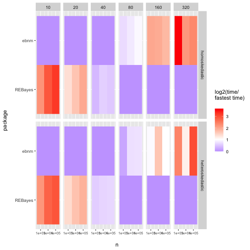
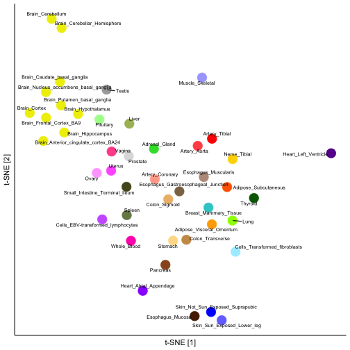
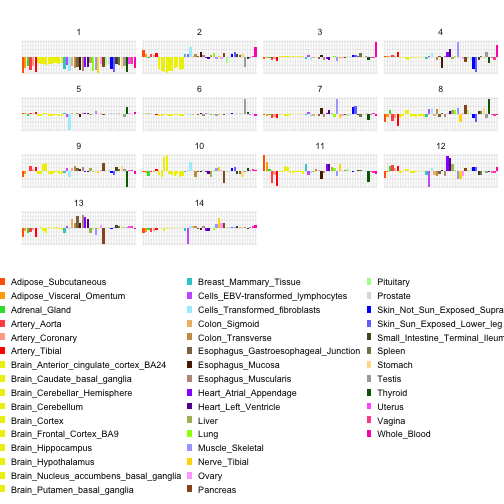
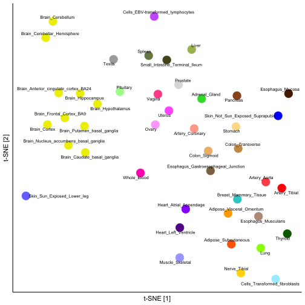
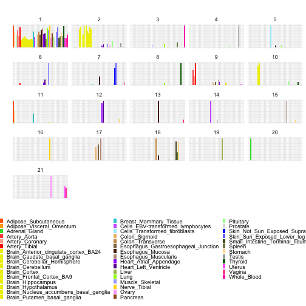

```r
###### HANDLE ARGS ----------------------------------------------------

args <- commandArgs(trailingOnly = TRUE)

valid.args <- args %in% c(
  "out-to-file", 
  "test",
  "full"
)
if (!all(valid.args)) {
  stop("Command line argument ",
       min(which(!valid.args)),
       " not recognized.")
}

test <- "test" %in% args
full <- "full" %in% args

if ("out-to-file" %in% args) {
  fname <- "../output/code_output"
  if (test) {
    fname <- paste0(fname, "_test")
  } 
  out_file <- file(paste0(fname, ".txt"), open = "wt")
  sink(out_file)
  sink(out_file, type = "message")
}

system("if [ ! -d ../figs ]; then mkdir ../figs; fi")


###### REQUIRED PACKAGES ----------------------------------------------

library(tidyverse)
library(ebnm)
library(flashier)
library(gt)

# Also needed: microbenchmark, scales, Rtsne, ggrepel, cowplot


###### TIMING STUDY ---------------------------------------------------

cat("\nTIMING STUDY...\n\n")
```

```
## 
## TIMING STUDY...
```

```r
#### Run simulations ----

set.seed(666)

if (exists("test") && test) {
  ns <- 10^seq(2, 3, by = 0.5)
  mb_times <- rep(2, length(ns))
  fname_suffix <- "_test"
} else if (exists("full") && full) {
  ns <- 10^seq(2, 6, by = 0.5)
  mb_times <- rep(20, length(ns))
  fname_suffix <- "_full"
} else {
  ns <- 10^seq(2, 4, by = 0.5)
  mb_times <- rep(20, length(ns))
  fname_suffix <- ""
}

cat(paste0("\nTiming different prior families.\n",
           "  n ranges from ", min(ns), " to ", max(ns), ".\n\n"))
```

```
## 
## Timing different prior families.
##   n ranges from 100 to 10000.
```

```r
# Mixture of point mass at zero and t_5
point_t <- function(n) {
  samp <- 1.5 * rt(n, df = 5)
  samp <- samp * sample(c(0, 1), n, replace = TRUE, prob = c(0.5, 0.5))
  return(samp + rnorm(n))
}

ebnm_fns <- c("ebnm_normal",
              "ebnm_point_normal",
              "ebnm_point_laplace",
              "ebnm_normal_scale_mixture",
              "ebnm_unimodal_symmetric",
              "ebnm_unimodal",
              "ebnm_deconvolver",
              "ebnm_npmle",
              "ebnm_horseshoe")

t_begin <- Sys.time()
res <- tibble()
for (i in 1:length(ns)) {
  n <- ns[i]
  cat("  n:", n, "\n")
  
  x <- point_t(n)
  
  test_fns <- ebnm_fns
  
  mb_tests <- lapply(test_fns, function(fn) {
    bquote(do.call(.(fn), list(x = x, s = 1)))
  })
  
  mb_res <- microbenchmark::microbenchmark(
    list = mb_tests,
    times = mb_times[i]
  )
  
  res <- res %>%
    bind_rows(
      tibble(mb_res) %>%
        mutate(expr = str_extract(expr, "ebnm.+\\\"")) %>%
        mutate(expr = str_remove(expr, "\\\"")) %>%
        mutate(n = n)
    )
}
```

```
##   n: 100 
##   n: 316.2278
```

```
## Warning in stats::nlm(f = loglik, p = aStart, gradtol = 1e-10, ...): NA/Inf replaced
## by maximum positive value

## Warning in stats::nlm(f = loglik, p = aStart, gradtol = 1e-10, ...): NA/Inf replaced
## by maximum positive value

## Warning in stats::nlm(f = loglik, p = aStart, gradtol = 1e-10, ...): NA/Inf replaced
## by maximum positive value

## Warning in stats::nlm(f = loglik, p = aStart, gradtol = 1e-10, ...): NA/Inf replaced
## by maximum positive value

## Warning in stats::nlm(f = loglik, p = aStart, gradtol = 1e-10, ...): NA/Inf replaced
## by maximum positive value

## Warning in stats::nlm(f = loglik, p = aStart, gradtol = 1e-10, ...): NA/Inf replaced
## by maximum positive value

## Warning in stats::nlm(f = loglik, p = aStart, gradtol = 1e-10, ...): NA/Inf replaced
## by maximum positive value

## Warning in stats::nlm(f = loglik, p = aStart, gradtol = 1e-10, ...): NA/Inf replaced
## by maximum positive value

## Warning in stats::nlm(f = loglik, p = aStart, gradtol = 1e-10, ...): NA/Inf replaced
## by maximum positive value

## Warning in stats::nlm(f = loglik, p = aStart, gradtol = 1e-10, ...): NA/Inf replaced
## by maximum positive value

## Warning in stats::nlm(f = loglik, p = aStart, gradtol = 1e-10, ...): NA/Inf replaced
## by maximum positive value

## Warning in stats::nlm(f = loglik, p = aStart, gradtol = 1e-10, ...): NA/Inf replaced
## by maximum positive value

## Warning in stats::nlm(f = loglik, p = aStart, gradtol = 1e-10, ...): NA/Inf replaced
## by maximum positive value

## Warning in stats::nlm(f = loglik, p = aStart, gradtol = 1e-10, ...): NA/Inf replaced
## by maximum positive value

## Warning in stats::nlm(f = loglik, p = aStart, gradtol = 1e-10, ...): NA/Inf replaced
## by maximum positive value

## Warning in stats::nlm(f = loglik, p = aStart, gradtol = 1e-10, ...): NA/Inf replaced
## by maximum positive value

## Warning in stats::nlm(f = loglik, p = aStart, gradtol = 1e-10, ...): NA/Inf replaced
## by maximum positive value

## Warning in stats::nlm(f = loglik, p = aStart, gradtol = 1e-10, ...): NA/Inf replaced
## by maximum positive value

## Warning in stats::nlm(f = loglik, p = aStart, gradtol = 1e-10, ...): NA/Inf replaced
## by maximum positive value

## Warning in stats::nlm(f = loglik, p = aStart, gradtol = 1e-10, ...): NA/Inf replaced
## by maximum positive value
```

```
##   n: 1000 
##   n: 3162.278 
##   n: 10000
```

```r
t_elapsed <- Sys.time() - t_begin
cat("  Done. Time elapsed:",
    round(as.numeric(t_elapsed, units = "mins"), 1), "minutes.\n")
```

```
##   Done. Time elapsed: 5.4 minutes.
```

```r
res <- res %>%
  mutate(expr = fct_relevel(expr, rev(ebnm_fns)))

saveRDS(res, paste0("../output/timecomps", fname_suffix, ".rds"))

#### Create figure ----

summary_res <- res %>%
  mutate(time = time / 1e9) %>%
  group_by(n, expr) %>%
  summarize(
    mean = mean(time),
    lowerq = quantile(time, probs = 0.1),
    upperq = quantile(time, probs = 0.9)
  ) 
```

```
## `summarise()` has grouped output by 'n'. You can override using the `.groups`
## argument.
```

```r
lvls <- summary_res %>%
  filter(n == ns[8]) %>%
  arrange(-mean) %>%
  pull(expr) %>%
  as.character()

summary_res <- summary_res %>%
  mutate(expr = fct_relevel(expr, lvls)) %>%
  mutate(expr = fct_relabel(expr, ~ str_remove(., "ebnm_")))

ggplot(summary_res, aes(x = n, y = mean, color = expr)) +
  geom_point() +
  geom_line(linewidth = 0.2) +
  geom_errorbar(aes(ymin = lowerq, ymax = upperq), width = 0.05) +
  scale_x_log10() +
  scale_y_log10() +
  scale_color_brewer(palette = "Set1") +
  labs(x = "\nNumber of observations", 
       y = "Runtime (s)\n", 
       col = "Prior family") +
  theme_minimal()
```


```r
ggsave(paste0("../figs/timecomps", fname_suffix, ".pdf"), 
       width = 6, height = 3.375)


###### SIMULATION STUDY -----------------------------------------------

cat("\nSIMULATION STUDY...\n\n")
```

```
## 
## SIMULATION STUDY...
```

```r
#### Simulation functions ----

normal <- function(n) {
  samp <- rnorm(n, sd = 2) 
  return(list(theta = samp, x = samp + rnorm(n)))
}

point_t <- function(n) {
  samp <- 1.5 * rt(n, df = 5) 
  samp <- samp * sample(c(0, 1), n, replace = TRUE, prob = c(0.8, 0.2))
  return(list(theta = samp, x = samp + rnorm(n)))
}

asymm_tophat <- function(n) {
  samp <- runif(n, -5, 10) 
  return(list(theta = samp, x = samp + rnorm(n)))
}

#### Run simulations ----

set.seed(666)

if (exists("test") && test) {
  nsim <- 1
  n <- 100
  fname_suffix <- "_test"
} else {
  nsim <- 10
  n <- 1000
  fname_suffix <- ""
}

ebnm_fns <- c("ebnm_flat",
              "ebnm_normal",
              "ebnm_point_normal",
              "ebnm_point_laplace",
              "ebnm_normal_scale_mixture",
              "ebnm_unimodal_symmetric",
              "ebnm_unimodal",
              "ebnm_npmle",
              "ebnm_deconvolver",
              "ebnm_horseshoe")
output <- c("posterior_mean",
            "log_likelihood",
            "posterior_sampler")
sim_fns <- c("normal",
             "point_t",
             "asymm_tophat")

all_res <- tibble()
for (sim_fn in sim_fns) {
  cat("  Sim function:", sim_fn, "\n")
  for (i in 1:nsim) {
    cat("    trial", i, "\n")
    set.seed(i)
    sim_data <- do.call(sim_fn, list(n = n))
    ebnm_res <- list()
    for (ebnm_fn in ebnm_fns) {
      ebnm_res[[ebnm_fn]] <- do.call(ebnm_fn, list(x = sim_data$x, s = 1, output = output))
    }
    
    llik <- sapply(ebnm_res, logLik)
    llik <- llik - max(llik, na.rm = TRUE)
    
    rmse <- sapply(ebnm_res, function(res) {
      return(sqrt(mean((coef(res) - sim_data$theta)^2)))
    })
    
    confint_cov <- sapply(ebnm_res, function(res) {
      zz <- capture.output({ # Capture horseshoe output
        ci <- confint(res, level = 0.9)
      })
      return(1 - mean(sim_data$theta < ci[, 1] | sim_data$theta > ci[, 2]))
    })
    
    tib <- tibble(
      SimFn = sim_fn,
      Function = names(llik), 
      LogLikelihood = llik, 
      RMSE = rmse, 
      ConfIntCov = confint_cov,
      SimNumber = i
    )
    
    all_res <- all_res %>%
      bind_rows(tib)
  }
}
```

```
##   Sim function: normal 
##     trial 1 
##     trial 2 
##     trial 3 
##     trial 4 
##     trial 5 
##     trial 6 
##     trial 7 
##     trial 8 
##     trial 9 
##     trial 10 
##   Sim function: point_t 
##     trial 1 
##     trial 2 
##     trial 3
```

```
## Warning in stats::nlm(f = loglik, p = aStart, gradtol = 1e-10, ...): NA/Inf replaced
## by maximum positive value
```

```
##     trial 4
```

```
## Warning in stats::nlm(f = loglik, p = aStart, gradtol = 1e-10, ...): NA/Inf replaced
## by maximum positive value

## Warning in stats::nlm(f = loglik, p = aStart, gradtol = 1e-10, ...): NA/Inf replaced
## by maximum positive value
```

```
##     trial 5
```

```
## Warning in stats::nlm(f = loglik, p = aStart, gradtol = 1e-10, ...): NA/Inf replaced
## by maximum positive value
```

```
##     trial 6 
##     trial 7 
##     trial 8 
##     trial 9 
##     trial 10
```

```
## Warning in stats::nlm(f = loglik, p = aStart, gradtol = 1e-10, ...): NA/Inf replaced
## by maximum positive value
```

```
##   Sim function: asymm_tophat 
##     trial 1 
##     trial 2 
##     trial 3 
##     trial 4 
##     trial 5 
##     trial 6 
##     trial 7 
##     trial 8 
##     trial 9 
##     trial 10
```

```r
saveRDS(all_res, paste0("../output/simstudy", fname_suffix, ".rds"))

#### Create results table ----

all_res <- all_res %>%
  mutate(Function = str_remove_all(Function, "ebnm_"))

ebnm_fns <- unique(all_res$Function)
sim_fns <- unique(all_res$SimFn)

res_table <- all_res %>%
  select(-SimNumber) %>%
  group_by(Function, SimFn) %>%
  summarize_all(mean) %>%
  ungroup() %>%
  mutate(
    Function = factor(Function, levels = ebnm_fns),
    SimFn = factor(SimFn, levels = sim_fns)
  ) %>%
  arrange(SimFn, Function) %>%
  rename(
    LogLik = LogLikelihood,
    CICov = ConfIntCov
  ) %>%
  pivot_wider(
    names_from = SimFn, 
    values_from = LogLik:CICov,
    names_sep = "XXX"
  )

lbls <- c("Prior Family", rep(c("Normal", "Point-t", "Tophat"), times = 3))
names(lbls) <- names(res_table)
lbls <- as.list(lbls)

rmse_pal <- function(x) {
  min_x <- min(x)
  f <- scales::col_numeric(
    palette = "Reds",
    domain = c(min_x, 1),
    reverse = FALSE
  )
  ifelse(x > 1, f(1), f(x))
}

ci_pal <- function(x) {
  pal_width <- max(abs(range(x) - 0.9))
  f_undercover <- scales::col_numeric(
    palette = "Greens",
    domain = c(0.9 - pal_width, 0.9),
    reverse = TRUE
  )
  f_overcover <- scales::col_numeric(
    palette = "Blues",
    domain = c(0.9, 0.9 + pal_width),
    reverse = FALSE
  )
  ifelse(x < 0.9, f_undercover(x), f_overcover(x))
}

tbl <- res_table %>%
  gt() %>%
  tab_spanner(
    label = "Log likelihood",
    columns = starts_with("Log")
  ) %>%
  tab_spanner(
    label = "RMSE",
    columns = starts_with("RMSE")
  ) %>%
  tab_spanner(
    label = "CI coverage",
    columns = starts_with("CICov")
  ) %>%
  fmt_number(
    columns = starts_with("Log"),
    decimals = 1
  ) %>%
  fmt_number(
    columns = starts_with(c("RMSE", "CI")),
    n_sigfig = 3 
  ) %>%
  data_color(
    columns = starts_with("Log"),
    colors = scales::col_numeric(
      palette = "Reds",
      domain = NULL,
      reverse = TRUE
    )) %>%
  data_color(
    columns = starts_with("RMSE"),
    colors = rmse_pal) %>%
  data_color(
    columns = starts_with("CI"),
    colors = ci_pal
  ) %>%
  cols_label(.list = lbls) %>%
  cols_align("left", columns = Function) %>%
  tab_style(
    style = "padding-left:12px;padding-right:12px;",
    locations = cells_body()
  )
```

```
## Warning: Some values were outside the color scale and will be treated as NA
```

```
## Warning: Some values were outside the color scale and will be treated as NA

## Warning: Some values were outside the color scale and will be treated as NA

## Warning: Some values were outside the color scale and will be treated as NA

## Warning: Some values were outside the color scale and will be treated as NA
```

```r
print(tbl)

gtsave(tbl, paste0("../figs/simres", fname_suffix, ".htm"))

# Convert using Adobe: width 9", height 5", margins 0.1", landscape, scale to fit


###### EXAMPLES -------------------------------------------------------

cat("\nEXAMPLES...\n\n")
```

```
## 
## EXAMPLES...
```

```r
#### wOBA (part I) ----

library(ebnm)
data(wOBA)
nrow(wOBA)
```

```
## [1] 688
```

```r
head(wOBA)
```

```
##   FanGraphsID           Name Team  PA     x     s
## 1       19952     Khalil Lee  NYM   2 1.036 0.733
## 2       16953 Chadwick Tromp  ATL   4 0.852 0.258
## 3       19608     Otto Lopez  TOR  10 0.599 0.162
## 4       24770   James Outman  LAD  16 0.584 0.151
## 5        8090 Matt Carpenter  NYY 154 0.472 0.054
## 6       15640    Aaron Judge  NYY 696 0.458 0.024
```

```r
library(ggplot2)
ggplot(wOBA, aes(x = x)) +
  geom_histogram(bins = 64, color = "black") +
  theme_classic()
```


```r
ggsave("../figs/wOBA_dist.pdf", height = 3, width = 5, units = "in")

x <- wOBA$x
s <- wOBA$s
names(x) <- wOBA$Name
names(s) <- wOBA$Name
fit_normal <- ebnm(x, s, prior_family = "normal", mode = "estimate")

fit_normal <- ebnm_normal(x, s, mode = "estimate")

summary(fit_normal)
```

```
## 
## Call:
## ebnm_normal(x = x, s = s, mode = "estimate")
## 
## EBNM model was fitted to 688 observations with _heteroskedastic_ standard errors.
## 
## The fitted prior belongs to the _normal_ prior family.
## 
## 2 degrees of freedom were used to estimate the model.
## The log likelihood is 989.64.
## 
## Available posterior summaries: _mean_, _sd_.
## Use method fitted() to access available summaries.
## 
## A posterior sampler is _not_ available.
## One can be added via function ebnm_add_sampler().
```

```r
plot(fit_normal)
```



```r
ggsave("../figs/wOBA_normal.pdf", height = 3, width = 5, units = "in")

plot(fit_normal) +
  geom_point(aes(color = sqrt(wOBA$PA))) +
  labs(x = "wOBA", y = "EB estimate of true wOBA skill", 
       color = expression(sqrt(PA))) +
  scale_color_gradient(low = "blue", high = "red")
```


```r
ggsave("../figs/wOBA_normal_custom.pdf", height = 3, width = 5, units = "in")

print(head(fitted(fit_normal)), digits = 3)
```

```
##                 mean     sd
## Khalil Lee     0.303 0.0287
## Chadwick Tromp 0.308 0.0286
## Otto Lopez     0.310 0.0283
## James Outman   0.311 0.0282
## Matt Carpenter 0.339 0.0254
## Aaron Judge    0.394 0.0184
```

```r
fit_unimodal <- ebnm(x, s, prior_family = "unimodal", mode = "estimate")

top50 <- order(wOBA$PA, decreasing = TRUE)
top50 <- top50[1:50]
plot(fit_normal, fit_unimodal, subset = top50)
```



```r
ggsave("../figs/wOBA_comp.pdf", height = 3, width = 5, units = "in")

dat <- cbind(wOBA[, c("PA","x")],
             fitted(fit_normal),
             fitted(fit_unimodal))
names(dat) <- c("PA", "x", "mean1", "sd1", "mean2", "sd2")
print(head(dat), digits = 3)
```

```
##                 PA     x mean1    sd1 mean2    sd2
## Khalil Lee       2 1.036 0.303 0.0287 0.302 0.0277
## Chadwick Tromp   4 0.852 0.308 0.0286 0.307 0.0306
## Otto Lopez      10 0.599 0.310 0.0283 0.310 0.0315
## James Outman    16 0.584 0.311 0.0282 0.311 0.0318
## Matt Carpenter 154 0.472 0.339 0.0254 0.355 0.0430
## Aaron Judge    696 0.458 0.394 0.0184 0.439 0.0155
```

```r
library(cowplot)
p1 <- plot(fit_normal, fit_unimodal, incl_cdf = TRUE, incl_pm = FALSE) +
  xlim(c(.250, .350)) +
  guides(color = "none")
p2 <- plot(fit_normal, fit_unimodal, incl_cdf = TRUE, incl_pm = FALSE) +
  lims(x = c(.350, .450), y = c(0.95, 1))
plot_grid(p1, p2, nrow = 1, ncol = 2, rel_widths = c(.4, .6))
```

```
## Warning: Removed 542 rows containing missing values (`geom_line()`).
```

```
## Warning: Removed 544 rows containing missing values (`geom_line()`).
```



```r
ggsave("../figs/wOBA_comp_cdf.pdf", height = 3, width = 10, units = "in")

fit_unimodal <- ebnm_add_sampler(fit_unimodal)
set.seed(1)
print(head(confint(fit_unimodal, level = 0.8)), digits = 3)
```

```
##                CI.lower CI.upper
## Khalil Lee        0.277    0.328
## Chadwick Tromp    0.277    0.334
## Otto Lopez        0.277    0.336
## James Outman      0.277    0.335
## Matt Carpenter    0.277    0.389
## Aaron Judge       0.428    0.458
```

```r
#### wOBA (part II) ----

fit_npmle <- ebnm(x, s, prior_family = "npmle")

fit_npmle <- ebnm(x, s, prior_family = "npmle", 
                  control = list(verbose = TRUE))
```

```
## Running mix-SQP algorithm 0.3-48 on 688 x 95 matrix
## convergence tol. (SQP):     1.0e-08
## conv. tol. (active-set):    1.0e-10
## zero threshold (solution):  1.0e-08
## zero thresh. (search dir.): 1.0e-14
## l.s. sufficient decrease:   1.0e-02
## step size reduction factor: 7.5e-01
## minimum step size:          1.0e-08
## max. iter (SQP):            1000
## max. iter (active-set):     20
## number of EM iterations:    10
## Computing SVD of 688 x 95 matrix.
## Matrix is not low-rank; falling back to full matrix.
## iter        objective max(rdual) nnz stepsize max.diff nqp nls
##    1 +9.583407733e-01  -- EM --   95 1.00e+00 6.08e-02  --  --
##    2 +8.298700300e-01  -- EM --   95 1.00e+00 2.87e-02  --  --
##    3 +7.955308369e-01  -- EM --   95 1.00e+00 1.60e-02  --  --
##    4 +7.819858634e-01  -- EM --   68 1.00e+00 1.05e-02  --  --
##    5 +7.753787534e-01  -- EM --   53 1.00e+00 7.57e-03  --  --
##    6 +7.717040208e-01  -- EM --   49 1.00e+00 5.73e-03  --  --
##    7 +7.694760705e-01  -- EM --   47 1.00e+00 4.48e-03  --  --
##    8 +7.680398878e-01  -- EM --   47 1.00e+00 3.58e-03  --  --
##    9 +7.670690681e-01  -- EM --   44 1.00e+00 2.91e-03  --  --
##   10 +7.663865515e-01  -- EM --   42 1.00e+00 2.40e-03  --  --
##    1 +7.658902386e-01 +6.493e-02  39  ------   ------   --  --
##    2 +7.655114904e-01 +5.285e-02  19 1.00e+00 9.88e-02  20   1
##    3 +7.627839841e-01 +1.411e-02   7 1.00e+00 1.28e-01  20   1
##    4 +7.626270875e-01 +2.494e-04   7 1.00e+00 3.23e-01   8   1
##    5 +7.626270755e-01 +1.748e-08   7 1.00e+00 4.94e-04   2   1
##    6 +7.626270755e-01 -2.796e-08   7 1.00e+00 2.76e-07   2   1
## Optimization took 0.03 seconds.
## Convergence criteria met---optimal solution found.
```

```r
# Slightly different from the text (need to show one plot at a time):
plot(
  fit_normal, fit_unimodal, fit_npmle,
  incl_cdf = TRUE,
  incl_pm = FALSE
) + xlim(0.25, 0.45) 
```

```
## Warning: Removed 729 rows containing missing values (`geom_line()`).
```


```r
ggsave("../figs/wOBA_npmle_cdf.pdf", height = 4, width = 6, units = "in")
```

```
## Warning: Removed 729 rows containing missing values (`geom_line()`).
```

```r
plot(
  fit_normal, fit_unimodal, fit_npmle,
  subset = top50,
  incl_cdf = FALSE,
  incl_pm = TRUE
)
```


```r
ggsave("../figs/wOBA_npmle_pm.pdf", height = 4, width = 6, units = "in")

logLik(fit_unimodal)
```

```
## 'log Lik.' 992.6578 (df=40)
```

```r
logLik(fit_npmle)
```

```
## 'log Lik.' 994.193 (df=94)
```

```r
scale_npmle <- ebnm_scale_npmle(x, s, KLdiv_target = 0.001/length(x), 
                                max_K = 1000)
fit_npmle_finer <- ebnm_npmle(x, s, scale = scale_npmle)
logLik(fit_npmle)
```

```
## 'log Lik.' 994.193 (df=94)
```

```r
logLik(fit_npmle_finer)
```

```
## 'log Lik.' 994.2502 (df=528)
```

```r
fit_npmle <- ebnm_add_sampler(fit_npmle)
print(head(quantile(fit_npmle, probs = c(0.1, 0.9))), digits = 3)
```

```
##                  10%   90%
## Khalil Lee     0.276 0.342
## Chadwick Tromp 0.276 0.342
## Otto Lopez     0.276 0.342
## James Outman   0.276 0.342
## Matt Carpenter 0.309 0.430
## Aaron Judge    0.419 0.430
```

```r
confint(fit_npmle, level = 0.8, parm = "Aaron Judge")
```

```
##              CI.lower  CI.upper
## Aaron Judge 0.4298298 0.4298298
```

```r
fit_deconv <- ebnm_deconvolver(x / s, output = ebnm_output_all()) 
plot(fit_deconv, incl_cdf = TRUE, incl_pm = FALSE)
```


```r
ggsave("../figs/wOBA_deconv.pdf", height = 4, width = 6, units = "in")

print(head(quantile(fit_deconv, probs = c(0.1, 0.9)) * s), digits = 3)
```

```
##                  10%   90%
## Khalil Lee     0.400 2.000
## Chadwick Tromp 0.563 1.127
## Otto Lopez     0.354 0.796
## James Outman   0.412 0.742
## Matt Carpenter 0.413 0.531
## Aaron Judge    0.406 0.459
```

```r
#### GTEx ----

library(flashier)
data(gtex)
nrow(gtex)
```

```
## [1] 1000
```

```r
ncol(gtex)
```

```
## [1] 44
```

```r
gtex[1:2, 1:2]
```

```
##                                       Adipose_Subcutaneous Adipose_Visceral_Omentum
## ENSG00000099977.9_22_24266954_A_C_b37             8.099352                6.4129683
## ENSG00000233868.1_2_222475922_A_G_b37             1.079264               -0.7760486
```

```r
library(Rtsne)
library(ggrepel)
set.seed(1)
out <- Rtsne(t(gtex), dims = 2, perplexity = 10)
pdat <- data.frame(d1 = out$Y[, 1],
                   d2 = out$Y[, 2],
                   tissue = colnames(gtex))
ggplot(pdat,aes(x = d1, y = d2, label = tissue)) +
  geom_point(size = 6, color = gtex_colors) +
  geom_text_repel(size = 2.5, max.overlaps = Inf) +
  labs(x = "t-SNE [1]", y = "t-SNE [2]") +
  theme_classic() +
  theme(axis.ticks = element_blank(),
        axis.text = element_blank())
```



```r
ggsave("../figs/gtex_tsne.pdf", height = 4, width = 6, units = "in")

t_n <- system.time({
  flash_n <- flash(gtex, ebnm_fn = ebnm_normal, backfit = TRUE)
})
```

```
## Adding factor 1 to flash object...
## Adding factor 2 to flash object...
## Adding factor 3 to flash object...
## Adding factor 4 to flash object...
## Adding factor 5 to flash object...
## Adding factor 6 to flash object...
## Adding factor 7 to flash object...
## Adding factor 8 to flash object...
## Adding factor 9 to flash object...
## Adding factor 10 to flash object...
## Adding factor 11 to flash object...
## Adding factor 12 to flash object...
## Adding factor 13 to flash object...
## Adding factor 14 to flash object...
## Adding factor 15 to flash object...
## Factor doesn't significantly increase objective and won't be added.
## Wrapping up...
## Done.
## Backfitting 14 factors (tolerance: 6.56e-04)...
##   Difference between iterations is within 1.0e+02...
##   Difference between iterations is within 1.0e+01...
##   Difference between iterations is within 1.0e+00...
##   Difference between iterations is within 1.0e-01...
##   Difference between iterations is within 1.0e-02...
## Wrapping up...
## Done.
## Nullchecking 14 factors...
## Done.
```

```r
t_n[3]
```

```
## elapsed 
##   0.809
```

```r
# Different from text (we add a legend here):
plot(flash_n, include_scree = FALSE, pm_colors = gtex_colors) +
  ggtitle("") +
  guides(fill = guide_legend(title = "", nrow = 16)) +
  theme(legend.text = element_text(size = 9),
        legend.key.size = unit(6, "points"),
        legend.position = "bottom") 
```


```r
ggsave("../figs/gtex_n.pdf", height = 7, width = 8, units = "in")

t_pn <- system.time({
  flash_pn <- flash(gtex, ebnm_fn = ebnm_point_normal, backfit = TRUE)
})
```

```
## Adding factor 1 to flash object...
## Adding factor 2 to flash object...
## Adding factor 3 to flash object...
## Adding factor 4 to flash object...
## Adding factor 5 to flash object...
## Adding factor 6 to flash object...
## Adding factor 7 to flash object...
## Adding factor 8 to flash object...
## Adding factor 9 to flash object...
## Adding factor 10 to flash object...
## Adding factor 11 to flash object...
## Adding factor 12 to flash object...
## Adding factor 13 to flash object...
## Adding factor 14 to flash object...
## Adding factor 15 to flash object...
## Adding factor 16 to flash object...
## Adding factor 17 to flash object...
## Adding factor 18 to flash object...
## Adding factor 19 to flash object...
## Adding factor 20 to flash object...
## Adding factor 21 to flash object...
## Adding factor 22 to flash object...
## Factor doesn't significantly increase objective and won't be added.
## Wrapping up...
## Done.
## Backfitting 21 factors (tolerance: 6.56e-04)...
##   Difference between iterations is within 1.0e+02...
##   Difference between iterations is within 1.0e+01...
##   Difference between iterations is within 1.0e+00...
##   Difference between iterations is within 1.0e-01...
##   Difference between iterations is within 1.0e-02...
##   Difference between iterations is within 1.0e-03...
## Wrapping up...
## Done.
## Nullchecking 21 factors...
## Done.
```

```r
t_pn[3]
```

```
## elapsed 
##   4.367
```

```r
# Different from text (we add a legend here):
plot(flash_pn, include_scree = FALSE, pm_colors = gtex_colors) +
  ggtitle("") +
  guides(fill = guide_legend(title = "", nrow = 16)) +
  theme(legend.text = element_text(size = 9),
        legend.key.size = unit(6, "points"),
        legend.position = "bottom") 
```


```r
ggsave("../figs/gtex_pn.pdf", height = 8, width = 8, units = "in")

t_snn <- system.time({
  flash_snn <- flash(gtex, 
                     ebnm_fn = c(ebnm_point_normal, ebnm_point_exponential), 
                     backfit = TRUE)
})
```

```
## Adding factor 1 to flash object...
## Adding factor 2 to flash object...
## Adding factor 3 to flash object...
## Adding factor 4 to flash object...
## Adding factor 5 to flash object...
## Adding factor 6 to flash object...
## Adding factor 7 to flash object...
## Adding factor 8 to flash object...
## Adding factor 9 to flash object...
## Adding factor 10 to flash object...
## Adding factor 11 to flash object...
## Adding factor 12 to flash object...
## Adding factor 13 to flash object...
## Adding factor 14 to flash object...
## Adding factor 15 to flash object...
## Adding factor 16 to flash object...
## Adding factor 17 to flash object...
## Adding factor 18 to flash object...
## Adding factor 19 to flash object...
## Adding factor 20 to flash object...
## Adding factor 21 to flash object...
## Adding factor 22 to flash object...
## Factor doesn't significantly increase objective and won't be added.
## Wrapping up...
## Done.
## Backfitting 21 factors (tolerance: 6.56e-04)...
##   Difference between iterations is within 1.0e+02...
##   Difference between iterations is within 1.0e+01...
##   Difference between iterations is within 1.0e+00...
##   Difference between iterations is within 1.0e-01...
##   Difference between iterations is within 1.0e-02...
##   Difference between iterations is within 1.0e-03...
## Wrapping up...
## Done.
## Nullchecking 21 factors...
## Done.
```

```r
t_snn[3]
```

```
## elapsed 
##    2.69
```

```r
# Different from text (we add a legend here):
plot(flash_snn, include_scree = FALSE, pm_colors = gtex_colors) +
  ggtitle("") +
  guides(fill = guide_legend(title = "", nrow = 16)) +
  theme(legend.text = element_text(size = 9),
        legend.key.size = unit(6, "points"),
        legend.position = "bottom") 
```



```r
ggsave("../figs/gtex_pe.pdf", height = 8, width = 8, units = "in")


###### SESSION INFO ---------------------------------------------------

cat("\n\n")
```

```r
sessionInfo()
```

```
## R version 4.2.1 (2022-06-23)
## Platform: aarch64-apple-darwin20 (64-bit)
## Running under: macOS Monterey 12.3
## 
## Matrix products: default
## LAPACK: /Library/Frameworks/R.framework/Versions/4.2-arm64/Resources/lib/libRlapack.dylib
## 
## locale:
## [1] en_US.UTF-8/en_US.UTF-8/en_US.UTF-8/C/en_US.UTF-8/en_US.UTF-8
## 
## attached base packages:
## [1] stats     graphics  grDevices utils     datasets  methods   base     
## 
## other attached packages:
##  [1] ggrepel_0.9.3         Rtsne_0.16            cowplot_1.1.1        
##  [4] gt_0.10.0             EbayesThresh_1.4-12   REBayes_2.54         
##  [7] Matrix_1.6-1.1        ashr_2.2-63           microbenchmark_1.4.10
## [10] flashier_1.0.7        magrittr_2.0.3        ebnm_1.1-2           
## [13] lubridate_1.9.3       forcats_1.0.0         stringr_1.5.0        
## [16] dplyr_1.1.3           purrr_1.0.2           readr_2.1.4          
## [19] tidyr_1.3.0           tibble_3.2.1          ggplot2_3.4.3        
## [22] tidyverse_2.0.0      
## 
## loaded via a namespace (and not attached):
##  [1] sass_0.4.7         splines_4.2.1      horseshoe_0.2.0    mixsqp_0.3-48     
##  [5] deconvolveR_1.2-1  pillar_1.9.0       lattice_0.21-9     glue_1.6.2        
##  [9] digest_0.6.33      RColorBrewer_1.1-3 colorspace_2.1-0   sandwich_3.0-2    
## [13] htmltools_0.5.6.1  pkgconfig_2.0.3    invgamma_1.1       mvtnorm_1.2-3     
## [17] scales_1.2.1       tzdb_0.4.0         timechange_0.2.0   generics_0.1.3    
## [21] farver_2.1.1       TH.data_1.1-2      withr_2.5.1        cli_3.6.1         
## [25] mime_0.12          survival_3.5-7     evaluate_0.22      fs_1.6.3          
## [29] fansi_1.0.5        wavethresh_4.7.2   Rmosek_10.0.25     MASS_7.3-60       
## [33] xml2_1.3.5         truncnorm_1.0-9    textshaping_0.3.7  tools_4.2.1       
## [37] hms_1.1.3          softImpute_1.4-1   lifecycle_1.0.3    multcomp_1.4-25   
## [41] trust_0.1-8        munsell_0.5.0      irlba_2.3.5.1      compiler_4.2.1    
## [45] systemfonts_1.0.5  rlang_1.1.1        grid_4.2.1         rstudioapi_0.15.0 
## [49] labeling_0.4.3     gtable_0.3.4       codetools_0.2-19   markdown_1.10     
## [53] R6_2.5.1           zoo_1.8-12         knitr_1.44         fastmap_1.1.1     
## [57] utf8_1.2.3         commonmark_1.9.0   ragg_1.2.6         stringi_1.7.12    
## [61] parallel_4.2.1     SQUAREM_2021.1     Rcpp_1.0.11        vctrs_0.6.3       
## [65] tidyselect_1.2.0   xfun_0.40
```

