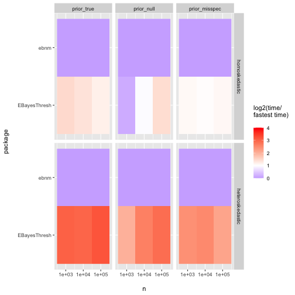

```r
###### HANDLE ARGS ----------------------------------------------------

args <- commandArgs(trailingOnly = TRUE)

valid.args <- args %in% c(
  "out-to-file", 
  "test"
)
if (!all(valid.args)) {
  stop("Command line argument ",
       min(which(!valid.args)),
       " not recognized.")
}

test <- "test" %in% args

if ("out-to-file" %in% args) {
  fname <- "../output/code_output_appendix"
  if (test) {
    fname <- paste0(fname, "_test")
  } 
  out_file <- file(paste0(fname, ".txt"), open = "wt")
  sink(out_file)
  sink(out_file, type = "message")
}

system("if [ ! -d ../figs ]; then mkdir ../figs; fi")


###### REQUIRED PACKAGES ----------------------------------------------

library(tidyverse)
library(ebnm)
library(flashier)
library(microbenchmark)
library(EbayesThresh)
library(ashr)
library(REBayes)


###### OPTMETHODS -----------------------------------------------------

cat("\nComparing ebnm optimization methods.\n",
    "This takes about 20 minutes per test.\n",
    "24 tests are performed.\n\n")
```

```
## 
## Comparing ebnm optimization methods.
##  This takes about 20 minutes per test.
##  24 tests are performed.
```

```r
null_sim <- function(n, s) {
  return(rnorm(n, sd = s))
}

pn_sim <- function(n, s) {
  pi0 <- rbeta(1, shape1 = 10, shape2 = 2)
  scale <- rgamma(1, shape = 4, rate = 1)
  
  theta <- rnorm(n, sd = scale)
  theta <- theta * rbinom(n, 1, 1 - pi0)
  x <- theta + rnorm(n, sd = s)
  
  return(x)
}

pn_nzmode_sim <- function(n, s) {
  mode <- runif(1, -10, 10)
  x <- pn_sim(n, s) + mode
  
  return(x)
}

pl_sim <- function(n, s) {
  pi0 <- rbeta(1, shape1 = 10, shape2 = 2)
  scale <- rgamma(1, shape = 4, rate = 1)
  
  theta <- rexp(n, rate = 1 / scale) * sample(c(-1, 1), n, replace = TRUE)
  theta <- theta * rbinom(n, 1, 1 - pi0)
  x <- theta + rnorm(n, sd = s)
  
  return(x)
}

pl_nzmode_sim <- function(n, s) {
  mode <- runif(1, -10, 10)
  x <- pl_sim(n, s) + mode
  
  return(x)
}

pt_sim <- function(n, s) {
  pi0 <- rbeta(1, shape1 = 10, shape2 = 2)
  scale <- rgamma(1, shape = 4, rate = 1)
  
  theta <- scale * rt(n, df = 5)
  theta <- theta * rbinom(n, 1, 1 - pi0)
  x <- theta + rnorm(n, sd = s)
  
  return(x)
}

pt_nzmode_sim <- function(n, s) {
  mode <- runif(1, -10, 10)
  x <- pt_sim(n, s) + mode
  
  return(x)
}

ebnm_pn_estmode <- function(...) {
  return(ebnm_point_normal(..., mode = "estimate"))
}

ebnm_pl_estmode <- function(...) {
  return(ebnm_point_laplace(..., mode =))
}

do_test <- function(n, sim_fn, homosked, ebnm_fn, nsim, mbtimes = 5L) {
  t <- rep(0, 6)
  bad_soln <- rep(0, 6)
  fail <- rep(0, 6)
  
  for (i in 1:nsim) {
    if (homosked) {
      s <- 1
    } else {
      s <- sqrt(1 + rexp(n))
    }
    
    x <- do.call(sim_fn, list(n = n, s = s))
    
    ebnm_args <- list(x = x, s = s, output = "log_likelihood")
    
    llik <- numeric(6)
    mb_res <- microbenchmark(
      llik[1] <- do.call(
        ebnm_fn, 
        c(ebnm_args, 
          list(optmethod = "nlm", 
               control = list(gradtol = sqrt(.Machine$double.eps))))
      )[["log_likelihood"]],
      llik[2] <- do.call(
        ebnm_fn, 
        c(ebnm_args, 
          list(optmethod = "nohess_nlm", 
               control = list(gradtol = sqrt(.Machine$double.eps))))
      )[["log_likelihood"]],
      llik[3] <- do.call(
        ebnm_fn, 
        c(ebnm_args, 
          list(optmethod = "nograd_nlm", 
               control = list(gradtol = sqrt(.Machine$double.eps))))
      )[["log_likelihood"]],
      llik[4] <- tryCatch(
        do.call(
          ebnm_fn,
          c(ebnm_args,
            list(optmethod = "lbfgsb",
                 control = list(pgtol = sqrt(.Machine$double.eps))))
        )[["log_likelihood"]],
        error = function(x) -Inf
      ),
      llik[5] <- tryCatch(
        do.call(ebnm_fn,
                c(ebnm_args,
                  list(optmethod = "nograd_lbfgsb",
                       control = list(pgtol = sqrt(.Machine$double.eps))))
        )[["log_likelihood"]],
        error = function(x) -Inf
      ),
      llik[6] <- do.call(
        ebnm_fn, 
        c(ebnm_args,
          list(optmethod = "trust",
               control = list(fterm = sqrt(.Machine$double.eps))))
      )[["log_likelihood"]],
      times = mbtimes
    )
    
    llik <- llik - max(llik)
    t <- t + summary(mb_res, unit = "s")$mean
    bad_soln <- bad_soln + 1L * (llik < -n * sqrt(.Machine$double.eps))
    fail <- fail + 1L * is.infinite(llik)
  }
  
  call <- match.call()
  res <- tibble(
    n = n,
    ebnm_fn = as.character(call$ebnm_fn),
    sim_fn = as.character(call$sim_fn),
    homosked = homosked,
    optmethod = c("nlm", "nohess_nlm", "nograd_nlm", "lbfgsb", "nograd_lbfgsb", "trust"),
    mean_t = t / nsim,
    p_bad_soln = bad_soln / nsim,
    p_fail = fail / nsim
  )
  
  return(res)
}

set.seed(666)
all_res <- tibble()
if (exists("test") && test) {
  ns <- 10^(2:3)
} else {
  ns <- 10^(3:5)
}

for (n in ns) {
  if (exists("test") && test) {
    nsim <- 1
  } else {
    nsim <- 10^6 / n
  }
  
  for (homosked in c(TRUE, FALSE)) {
    cat("  Testing ebnm_point_normal: n =", n, ", homosked =", homosked, "\n")
    all_res <- all_res %>%
      bind_rows(do_test(n = n, sim_fn = pn_sim, homosked = homosked, 
                        ebnm_fn = ebnm_point_normal, nsim = nsim)) %>%
      bind_rows(do_test(n = n, sim_fn = null_sim, homosked = homosked, 
                        ebnm_fn = ebnm_point_normal, nsim = nsim)) %>%
      bind_rows(do_test(n = n, sim_fn = pn_nzmode_sim, homosked = homosked, 
                        ebnm_fn = ebnm_point_normal, nsim = nsim)) 
    cat("  Testing ebnm_pn_estmode: n =", n, ", homosked = ", homosked, "\n")
    all_res <- all_res %>%
      bind_rows(do_test(n = n, sim_fn = pn_nzmode_sim, homosked = homosked, 
                        ebnm_fn = ebnm_pn_estmode, nsim = nsim)) %>%
      bind_rows(do_test(n = n, sim_fn = null_sim, homosked = homosked, 
                        ebnm_fn = ebnm_pn_estmode, nsim = nsim)) %>%
      bind_rows(do_test(n = n, sim_fn = pt_nzmode_sim, homosked = homosked, 
                        ebnm_fn = ebnm_pn_estmode, nsim = nsim))
    cat("  Testing ebnm_point_laplace: n =", n, ", homosked =", homosked, "\n")
    all_res <- all_res %>%
      bind_rows(do_test(n = n, sim_fn = pl_sim, homosked = homosked, 
                        ebnm_fn = ebnm_point_laplace, nsim = nsim)) %>%
      bind_rows(do_test(n = n, sim_fn = null_sim, homosked = homosked, 
                        ebnm_fn = ebnm_point_laplace, nsim = nsim)) %>%
      bind_rows(do_test(n = n, sim_fn = pl_nzmode_sim, homosked = homosked, 
                        ebnm_fn = ebnm_point_laplace, nsim = nsim)) 
    cat("  Testing ebnm_pl_estmode: n =", n, ", homosked = ", homosked, "\n")
    all_res <- all_res %>%
      bind_rows(do_test(n = n, sim_fn = pl_nzmode_sim, homosked = homosked, 
                        ebnm_fn = ebnm_pl_estmode, nsim = nsim)) %>%
      bind_rows(do_test(n = n, sim_fn = null_sim, homosked = homosked, 
                        ebnm_fn = ebnm_pl_estmode, nsim = nsim)) %>%
      bind_rows(do_test(n = n, sim_fn = pt_nzmode_sim, homosked = homosked, 
                        ebnm_fn = ebnm_pl_estmode, nsim = nsim))
  }
}
```

```
##   Testing ebnm_point_normal: n = 1000 , homosked = TRUE 
##   Testing ebnm_pn_estmode: n = 1000 , homosked =  TRUE 
##   Testing ebnm_point_laplace: n = 1000 , homosked = TRUE 
##   Testing ebnm_pl_estmode: n = 1000 , homosked =  TRUE 
##   Testing ebnm_point_normal: n = 1000 , homosked = FALSE 
##   Testing ebnm_pn_estmode: n = 1000 , homosked =  FALSE 
##   Testing ebnm_point_laplace: n = 1000 , homosked = FALSE 
##   Testing ebnm_pl_estmode: n = 1000 , homosked =  FALSE 
##   Testing ebnm_point_normal: n = 10000 , homosked = TRUE 
##   Testing ebnm_pn_estmode: n = 10000 , homosked =  TRUE 
##   Testing ebnm_point_laplace: n = 10000 , homosked = TRUE 
##   Testing ebnm_pl_estmode: n = 10000 , homosked =  TRUE 
##   Testing ebnm_point_normal: n = 10000 , homosked = FALSE 
##   Testing ebnm_pn_estmode: n = 10000 , homosked =  FALSE 
##   Testing ebnm_point_laplace: n = 10000 , homosked = FALSE 
##   Testing ebnm_pl_estmode: n = 10000 , homosked =  FALSE 
##   Testing ebnm_point_normal: n = 1e+05 , homosked = TRUE 
##   Testing ebnm_pn_estmode: n = 1e+05 , homosked =  TRUE 
##   Testing ebnm_point_laplace: n = 1e+05 , homosked = TRUE 
##   Testing ebnm_pl_estmode: n = 1e+05 , homosked =  TRUE 
##   Testing ebnm_point_normal: n = 1e+05 , homosked = FALSE 
##   Testing ebnm_pn_estmode: n = 1e+05 , homosked =  FALSE 
##   Testing ebnm_point_laplace: n = 1e+05 , homosked = FALSE 
##   Testing ebnm_pl_estmode: n = 1e+05 , homosked =  FALSE
```

```r
saveRDS(all_res, "../output/optmethods.rds")

## Generate figures:

optmethods <- all_res %>%
  mutate(prior = case_when(
    sim_fn == "null_sim" ~ "prior_null",
    sim_fn %in% c("pn_sim", "pl_sim") ~ "prior_true",
    ebnm_fn %in% c("ebnm_pn_estmode", "ebnm_pl_estmode") &
      sim_fn %in% c("pn_nzmode_sim", "pl_nzmode_sim") ~ "prior_true",
    TRUE ~ "prior_misspec"
  )) %>%
  mutate(homosked = ifelse(homosked, "homoskedastic", "heteroskedastic"),
         homosked = fct_relevel(homosked, "homoskedastic", "heteroskedastic"),
         prior = fct_relevel(prior, "prior_true", "prior_null", "prior_misspec")) %>%
  group_by(ebnm_fn, n, homosked, prior) %>%
  mutate(t_penalty = log2(mean_t / min(mean_t))) %>%
  ungroup()

for (next_ebnm_fn in unique(optmethods$ebnm_fn)) {
  plt_title <- ifelse(next_ebnm_fn %in% c("ebnm_point_normal", "ebnm_point_laplace"),
                      "Mode: fixed at zero\n",
                      "Mode: estimated\n")
  
  plt <- ggplot(optmethods %>% filter(ebnm_fn == next_ebnm_fn), 
                aes(x = n, y = optmethod, fill = t_penalty)) +
    scale_x_log10() +
    scale_y_discrete(limits = c("nograd_lbfgsb", "nograd_nlm",
                                "lbfgsb", "nohess_nlm",
                                "trust", "nlm")) +
    geom_raster() +
    scale_fill_gradient2(low = "blue", mid = "white", high = "red", midpoint = 1, 
                         limits = c(0, 4)) +
    labs(x = "\nn", y = "optmethod\n", fill = "log2(time/\nfastest time)\n",
         title = plt_title) +
    facet_grid(cols = vars(prior), rows = vars(homosked))
  
  ggsave(paste0("../figs/optmethods_", next_ebnm_fn, ".pdf"), width = 7, height = 5,
         plot = plt)
}


###### EBNM V EBAYESTHRESH --------------------------------------------

cat("\nComparing ebnm_point_laplace and EBayesThresh.\n",
    "This takes about 20 minutes per test.\n",
    "Six tests are performed.\n\n")
```

```
## 
## Comparing ebnm_point_laplace and EBayesThresh.
##  This takes about 20 minutes per test.
##  Six tests are performed.
```

```r
null_sim <- function(n, s) {
  return(rnorm(n, sd = s))
}

pl_sim <- function(n, s) {
  pi0 <- rbeta(1, shape1 = 10, shape2 = 2)
  scale <- rgamma(1, shape = 4, rate = 1)
  
  theta <- rexp(n, rate = 1 / scale) * sample(c(-1, 1), n, replace = TRUE)
  theta <- theta * rbinom(n, 1, 1 - pi0)
  x <- theta + rnorm(n, sd = s)
  
  return(x)
}

pl_nzmode_sim <- function(n, s) {
  mode <- runif(1, -10, 10)
  x <- pl_sim(n, s) + mode
  
  return(x)
}

do_test <- function(n, sim_fn, homosked, nsim, mbtimes = 5L) {
  t <- rep(0, 2)
  ourbad <- 0
  theirbad <- 0
  theirfail <- 0
  
  for (i in 1:nsim) {
    if (homosked) {
      s <- 1
    } else {
      s <- sqrt(1 + rexp(n))
    }
    
    x <- do.call(sim_fn, list(n = n, s = s))
    
    mb_res <- microbenchmark(
      ourres <- ebnm_point_laplace(x = x, s = s, optmethod = "nohess_nlm",
                                   control = list(gradtol = sqrt(.Machine$double.eps)),
                                   output = c("posterior_mean", "log_likelihood")),
      theirres <- tryCatch(
        ebayesthresh(x = x, sdev = s, a = NA, threshrule = "mean", 
                     universalthresh = FALSE, verbose = TRUE),
        error = function(x) list(w = NULL, a = NULL)
      ),
      times = mbtimes
    )
    
    ourllik <- ourres$log_likelihood
    if (is.null(theirres$w)) {
      theirllik <- -Inf
    } else {
      theirllik <- ebnm:::loglik_point_laplace(x, s, theirres$w, theirres$a, 0)
    }
    
    llik_diff <- ourllik - theirllik
    
    t <- t + summary(mb_res, unit = "s")$mean
    ourbad <- ourbad + 1L * (llik_diff < -n * sqrt(.Machine$double.eps))
    theirbad <- theirbad + 1L * (llik_diff > n * sqrt(.Machine$double.eps))
    theirfail <- theirfail + 1L * is.infinite(theirllik)
  }
  
  call <- match.call()
  res <- tibble(
    n = n,
    sim_fn = as.character(call$sim_fn),
    homosked = homosked,
    package = c("ebnm", "EBayesThresh"),
    mean_t = t / nsim,
    p_bad_soln = c(ourbad, theirbad) / nsim,
    p_fail = c(0, theirfail) / nsim
  )
  
  return(res)
}

set.seed(666)
all_res <- tibble()
if (exists("test") && test) {
  ns <- 10^(2:3)
} else {
  ns <- 10^(3:5)
}

for (n in ns) {
  if (exists("test") && test) {
    nsim <- 1
  } else {
    nsim <- 10^6 / n
  }
  
  for (homosked in c(TRUE, FALSE)) {
    cat("  Testing n =", n, ", homosked =", homosked, "\n")
    all_res <- all_res %>%
      bind_rows(do_test(n = n, sim_fn = pl_sim, homosked = homosked, nsim = nsim)) %>%
      bind_rows(do_test(n = n, sim_fn = null_sim, homosked = homosked, nsim = nsim)) %>%
      bind_rows(do_test(n = n, sim_fn = pl_nzmode_sim, homosked = homosked, nsim = nsim)) 
  }
}
```

```
##   Testing n = 1000 , homosked = TRUE
```

```
## Warning in log(1 + (xpar[1] * (whi - wlo) + wlo) * beta.laplace(xx, ss, : NaNs
## produced

## Warning in log(1 + (xpar[1] * (whi - wlo) + wlo) * beta.laplace(xx, ss, : NaNs
## produced

## Warning in log(1 + (xpar[1] * (whi - wlo) + wlo) * beta.laplace(xx, ss, : NaNs
## produced

## Warning in log(1 + (xpar[1] * (whi - wlo) + wlo) * beta.laplace(xx, ss, : NaNs
## produced

## Warning in log(1 + (xpar[1] * (whi - wlo) + wlo) * beta.laplace(xx, ss, : NaNs
## produced

## Warning in log(1 + (xpar[1] * (whi - wlo) + wlo) * beta.laplace(xx, ss, : NaNs
## produced

## Warning in log(1 + (xpar[1] * (whi - wlo) + wlo) * beta.laplace(xx, ss, : NaNs
## produced

## Warning in log(1 + (xpar[1] * (whi - wlo) + wlo) * beta.laplace(xx, ss, : NaNs
## produced

## Warning in log(1 + (xpar[1] * (whi - wlo) + wlo) * beta.laplace(xx, ss, : NaNs
## produced

## Warning in log(1 + (xpar[1] * (whi - wlo) + wlo) * beta.laplace(xx, ss, : NaNs
## produced

## Warning in log(1 + (xpar[1] * (whi - wlo) + wlo) * beta.laplace(xx, ss, : NaNs
## produced

## Warning in log(1 + (xpar[1] * (whi - wlo) + wlo) * beta.laplace(xx, ss, : NaNs
## produced

## Warning in log(1 + (xpar[1] * (whi - wlo) + wlo) * beta.laplace(xx, ss, : NaNs
## produced

## Warning in log(1 + (xpar[1] * (whi - wlo) + wlo) * beta.laplace(xx, ss, : NaNs
## produced

## Warning in log(1 + (xpar[1] * (whi - wlo) + wlo) * beta.laplace(xx, ss, : NaNs
## produced

## Warning in log(1 + (xpar[1] * (whi - wlo) + wlo) * beta.laplace(xx, ss, : NaNs
## produced

## Warning in log(1 + (xpar[1] * (whi - wlo) + wlo) * beta.laplace(xx, ss, : NaNs
## produced

## Warning in log(1 + (xpar[1] * (whi - wlo) + wlo) * beta.laplace(xx, ss, : NaNs
## produced

## Warning in log(1 + (xpar[1] * (whi - wlo) + wlo) * beta.laplace(xx, ss, : NaNs
## produced

## Warning in log(1 + (xpar[1] * (whi - wlo) + wlo) * beta.laplace(xx, ss, : NaNs
## produced

## Warning in log(1 + (xpar[1] * (whi - wlo) + wlo) * beta.laplace(xx, ss, : NaNs
## produced

## Warning in log(1 + (xpar[1] * (whi - wlo) + wlo) * beta.laplace(xx, ss, : NaNs
## produced

## Warning in log(1 + (xpar[1] * (whi - wlo) + wlo) * beta.laplace(xx, ss, : NaNs
## produced

## Warning in log(1 + (xpar[1] * (whi - wlo) + wlo) * beta.laplace(xx, ss, : NaNs
## produced

## Warning in log(1 + (xpar[1] * (whi - wlo) + wlo) * beta.laplace(xx, ss, : NaNs
## produced

## Warning in log(1 + (xpar[1] * (whi - wlo) + wlo) * beta.laplace(xx, ss, : NaNs
## produced

## Warning in log(1 + (xpar[1] * (whi - wlo) + wlo) * beta.laplace(xx, ss, : NaNs
## produced

## Warning in log(1 + (xpar[1] * (whi - wlo) + wlo) * beta.laplace(xx, ss, : NaNs
## produced

## Warning in log(1 + (xpar[1] * (whi - wlo) + wlo) * beta.laplace(xx, ss, : NaNs
## produced

## Warning in log(1 + (xpar[1] * (whi - wlo) + wlo) * beta.laplace(xx, ss, : NaNs
## produced

## Warning in log(1 + (xpar[1] * (whi - wlo) + wlo) * beta.laplace(xx, ss, : NaNs
## produced

## Warning in log(1 + (xpar[1] * (whi - wlo) + wlo) * beta.laplace(xx, ss, : NaNs
## produced

## Warning in log(1 + (xpar[1] * (whi - wlo) + wlo) * beta.laplace(xx, ss, : NaNs
## produced

## Warning in log(1 + (xpar[1] * (whi - wlo) + wlo) * beta.laplace(xx, ss, : NaNs
## produced

## Warning in log(1 + (xpar[1] * (whi - wlo) + wlo) * beta.laplace(xx, ss, : NaNs
## produced

## Warning in log(1 + (xpar[1] * (whi - wlo) + wlo) * beta.laplace(xx, ss, : NaNs
## produced

## Warning in log(1 + (xpar[1] * (whi - wlo) + wlo) * beta.laplace(xx, ss, : NaNs
## produced

## Warning in log(1 + (xpar[1] * (whi - wlo) + wlo) * beta.laplace(xx, ss, : NaNs
## produced

## Warning in log(1 + (xpar[1] * (whi - wlo) + wlo) * beta.laplace(xx, ss, : NaNs
## produced

## Warning in log(1 + (xpar[1] * (whi - wlo) + wlo) * beta.laplace(xx, ss, : NaNs
## produced

## Warning in log(1 + (xpar[1] * (whi - wlo) + wlo) * beta.laplace(xx, ss, : NaNs
## produced

## Warning in log(1 + (xpar[1] * (whi - wlo) + wlo) * beta.laplace(xx, ss, : NaNs
## produced

## Warning in log(1 + (xpar[1] * (whi - wlo) + wlo) * beta.laplace(xx, ss, : NaNs
## produced

## Warning in log(1 + (xpar[1] * (whi - wlo) + wlo) * beta.laplace(xx, ss, : NaNs
## produced

## Warning in log(1 + (xpar[1] * (whi - wlo) + wlo) * beta.laplace(xx, ss, : NaNs
## produced

## Warning in log(1 + (xpar[1] * (whi - wlo) + wlo) * beta.laplace(xx, ss, : NaNs
## produced

## Warning in log(1 + (xpar[1] * (whi - wlo) + wlo) * beta.laplace(xx, ss, : NaNs
## produced

## Warning in log(1 + (xpar[1] * (whi - wlo) + wlo) * beta.laplace(xx, ss, : NaNs
## produced

## Warning in log(1 + (xpar[1] * (whi - wlo) + wlo) * beta.laplace(xx, ss, : NaNs
## produced

## Warning in log(1 + (xpar[1] * (whi - wlo) + wlo) * beta.laplace(xx, ss, : NaNs
## produced

## Warning in log(1 + (xpar[1] * (whi - wlo) + wlo) * beta.laplace(xx, ss, : NaNs
## produced

## Warning in log(1 + (xpar[1] * (whi - wlo) + wlo) * beta.laplace(xx, ss, : NaNs
## produced

## Warning in log(1 + (xpar[1] * (whi - wlo) + wlo) * beta.laplace(xx, ss, : NaNs
## produced

## Warning in log(1 + (xpar[1] * (whi - wlo) + wlo) * beta.laplace(xx, ss, : NaNs
## produced

## Warning in log(1 + (xpar[1] * (whi - wlo) + wlo) * beta.laplace(xx, ss, : NaNs
## produced

## Warning in log(1 + (xpar[1] * (whi - wlo) + wlo) * beta.laplace(xx, ss, : NaNs
## produced

## Warning in log(1 + (xpar[1] * (whi - wlo) + wlo) * beta.laplace(xx, ss, : NaNs
## produced

## Warning in log(1 + (xpar[1] * (whi - wlo) + wlo) * beta.laplace(xx, ss, : NaNs
## produced

## Warning in log(1 + (xpar[1] * (whi - wlo) + wlo) * beta.laplace(xx, ss, : NaNs
## produced

## Warning in log(1 + (xpar[1] * (whi - wlo) + wlo) * beta.laplace(xx, ss, : NaNs
## produced

## Warning in log(1 + (xpar[1] * (whi - wlo) + wlo) * beta.laplace(xx, ss, : NaNs
## produced

## Warning in log(1 + (xpar[1] * (whi - wlo) + wlo) * beta.laplace(xx, ss, : NaNs
## produced

## Warning in log(1 + (xpar[1] * (whi - wlo) + wlo) * beta.laplace(xx, ss, : NaNs
## produced

## Warning in log(1 + (xpar[1] * (whi - wlo) + wlo) * beta.laplace(xx, ss, : NaNs
## produced

## Warning in log(1 + (xpar[1] * (whi - wlo) + wlo) * beta.laplace(xx, ss, : NaNs
## produced

## Warning in log(1 + (xpar[1] * (whi - wlo) + wlo) * beta.laplace(xx, ss, : NaNs
## produced

## Warning in log(1 + (xpar[1] * (whi - wlo) + wlo) * beta.laplace(xx, ss, : NaNs
## produced

## Warning in log(1 + (xpar[1] * (whi - wlo) + wlo) * beta.laplace(xx, ss, : NaNs
## produced

## Warning in log(1 + (xpar[1] * (whi - wlo) + wlo) * beta.laplace(xx, ss, : NaNs
## produced

## Warning in log(1 + (xpar[1] * (whi - wlo) + wlo) * beta.laplace(xx, ss, : NaNs
## produced

## Warning in log(1 + (xpar[1] * (whi - wlo) + wlo) * beta.laplace(xx, ss, : NaNs
## produced

## Warning in log(1 + (xpar[1] * (whi - wlo) + wlo) * beta.laplace(xx, ss, : NaNs
## produced

## Warning in log(1 + (xpar[1] * (whi - wlo) + wlo) * beta.laplace(xx, ss, : NaNs
## produced

## Warning in log(1 + (xpar[1] * (whi - wlo) + wlo) * beta.laplace(xx, ss, : NaNs
## produced

## Warning in log(1 + (xpar[1] * (whi - wlo) + wlo) * beta.laplace(xx, ss, : NaNs
## produced

## Warning in log(1 + (xpar[1] * (whi - wlo) + wlo) * beta.laplace(xx, ss, : NaNs
## produced

## Warning in log(1 + (xpar[1] * (whi - wlo) + wlo) * beta.laplace(xx, ss, : NaNs
## produced

## Warning in log(1 + (xpar[1] * (whi - wlo) + wlo) * beta.laplace(xx, ss, : NaNs
## produced

## Warning in log(1 + (xpar[1] * (whi - wlo) + wlo) * beta.laplace(xx, ss, : NaNs
## produced

## Warning in log(1 + (xpar[1] * (whi - wlo) + wlo) * beta.laplace(xx, ss, : NaNs
## produced

## Warning in log(1 + (xpar[1] * (whi - wlo) + wlo) * beta.laplace(xx, ss, : NaNs
## produced

## Warning in log(1 + (xpar[1] * (whi - wlo) + wlo) * beta.laplace(xx, ss, : NaNs
## produced

## Warning in log(1 + (xpar[1] * (whi - wlo) + wlo) * beta.laplace(xx, ss, : NaNs
## produced

## Warning in log(1 + (xpar[1] * (whi - wlo) + wlo) * beta.laplace(xx, ss, : NaNs
## produced

## Warning in log(1 + (xpar[1] * (whi - wlo) + wlo) * beta.laplace(xx, ss, : NaNs
## produced

## Warning in log(1 + (xpar[1] * (whi - wlo) + wlo) * beta.laplace(xx, ss, : NaNs
## produced

## Warning in log(1 + (xpar[1] * (whi - wlo) + wlo) * beta.laplace(xx, ss, : NaNs
## produced

## Warning in log(1 + (xpar[1] * (whi - wlo) + wlo) * beta.laplace(xx, ss, : NaNs
## produced

## Warning in log(1 + (xpar[1] * (whi - wlo) + wlo) * beta.laplace(xx, ss, : NaNs
## produced

## Warning in log(1 + (xpar[1] * (whi - wlo) + wlo) * beta.laplace(xx, ss, : NaNs
## produced

## Warning in log(1 + (xpar[1] * (whi - wlo) + wlo) * beta.laplace(xx, ss, : NaNs
## produced

## Warning in log(1 + (xpar[1] * (whi - wlo) + wlo) * beta.laplace(xx, ss, : NaNs
## produced

## Warning in log(1 + (xpar[1] * (whi - wlo) + wlo) * beta.laplace(xx, ss, : NaNs
## produced

## Warning in log(1 + (xpar[1] * (whi - wlo) + wlo) * beta.laplace(xx, ss, : NaNs
## produced

## Warning in log(1 + (xpar[1] * (whi - wlo) + wlo) * beta.laplace(xx, ss, : NaNs
## produced
```

```
##   Testing n = 1000 , homosked = FALSE
```

```
## Warning in log(1 + (xpar[1] * (whi - wlo) + wlo) * beta.laplace(xx, ss, : NaNs
## produced

## Warning in log(1 + (xpar[1] * (whi - wlo) + wlo) * beta.laplace(xx, ss, : NaNs
## produced

## Warning in log(1 + (xpar[1] * (whi - wlo) + wlo) * beta.laplace(xx, ss, : NaNs
## produced

## Warning in log(1 + (xpar[1] * (whi - wlo) + wlo) * beta.laplace(xx, ss, : NaNs
## produced

## Warning in log(1 + (xpar[1] * (whi - wlo) + wlo) * beta.laplace(xx, ss, : NaNs
## produced

## Warning in log(1 + (xpar[1] * (whi - wlo) + wlo) * beta.laplace(xx, ss, : NaNs
## produced

## Warning in log(1 + (xpar[1] * (whi - wlo) + wlo) * beta.laplace(xx, ss, : NaNs
## produced

## Warning in log(1 + (xpar[1] * (whi - wlo) + wlo) * beta.laplace(xx, ss, : NaNs
## produced

## Warning in log(1 + (xpar[1] * (whi - wlo) + wlo) * beta.laplace(xx, ss, : NaNs
## produced

## Warning in log(1 + (xpar[1] * (whi - wlo) + wlo) * beta.laplace(xx, ss, : NaNs
## produced

## Warning in log(1 + (xpar[1] * (whi - wlo) + wlo) * beta.laplace(xx, ss, : NaNs
## produced

## Warning in log(1 + (xpar[1] * (whi - wlo) + wlo) * beta.laplace(xx, ss, : NaNs
## produced

## Warning in log(1 + (xpar[1] * (whi - wlo) + wlo) * beta.laplace(xx, ss, : NaNs
## produced

## Warning in log(1 + (xpar[1] * (whi - wlo) + wlo) * beta.laplace(xx, ss, : NaNs
## produced

## Warning in log(1 + (xpar[1] * (whi - wlo) + wlo) * beta.laplace(xx, ss, : NaNs
## produced

## Warning in log(1 + (xpar[1] * (whi - wlo) + wlo) * beta.laplace(xx, ss, : NaNs
## produced

## Warning in log(1 + (xpar[1] * (whi - wlo) + wlo) * beta.laplace(xx, ss, : NaNs
## produced

## Warning in log(1 + (xpar[1] * (whi - wlo) + wlo) * beta.laplace(xx, ss, : NaNs
## produced

## Warning in log(1 + (xpar[1] * (whi - wlo) + wlo) * beta.laplace(xx, ss, : NaNs
## produced

## Warning in log(1 + (xpar[1] * (whi - wlo) + wlo) * beta.laplace(xx, ss, : NaNs
## produced

## Warning in log(1 + (xpar[1] * (whi - wlo) + wlo) * beta.laplace(xx, ss, : NaNs
## produced

## Warning in log(1 + (xpar[1] * (whi - wlo) + wlo) * beta.laplace(xx, ss, : NaNs
## produced

## Warning in log(1 + (xpar[1] * (whi - wlo) + wlo) * beta.laplace(xx, ss, : NaNs
## produced

## Warning in log(1 + (xpar[1] * (whi - wlo) + wlo) * beta.laplace(xx, ss, : NaNs
## produced

## Warning in log(1 + (xpar[1] * (whi - wlo) + wlo) * beta.laplace(xx, ss, : NaNs
## produced

## Warning in log(1 + (xpar[1] * (whi - wlo) + wlo) * beta.laplace(xx, ss, : NaNs
## produced

## Warning in log(1 + (xpar[1] * (whi - wlo) + wlo) * beta.laplace(xx, ss, : NaNs
## produced

## Warning in log(1 + (xpar[1] * (whi - wlo) + wlo) * beta.laplace(xx, ss, : NaNs
## produced

## Warning in log(1 + (xpar[1] * (whi - wlo) + wlo) * beta.laplace(xx, ss, : NaNs
## produced

## Warning in log(1 + (xpar[1] * (whi - wlo) + wlo) * beta.laplace(xx, ss, : NaNs
## produced

## Warning in log(1 + (xpar[1] * (whi - wlo) + wlo) * beta.laplace(xx, ss, : NaNs
## produced

## Warning in log(1 + (xpar[1] * (whi - wlo) + wlo) * beta.laplace(xx, ss, : NaNs
## produced

## Warning in log(1 + (xpar[1] * (whi - wlo) + wlo) * beta.laplace(xx, ss, : NaNs
## produced

## Warning in log(1 + (xpar[1] * (whi - wlo) + wlo) * beta.laplace(xx, ss, : NaNs
## produced

## Warning in log(1 + (xpar[1] * (whi - wlo) + wlo) * beta.laplace(xx, ss, : NaNs
## produced

## Warning in log(1 + (xpar[1] * (whi - wlo) + wlo) * beta.laplace(xx, ss, : NaNs
## produced

## Warning in log(1 + (xpar[1] * (whi - wlo) + wlo) * beta.laplace(xx, ss, : NaNs
## produced

## Warning in log(1 + (xpar[1] * (whi - wlo) + wlo) * beta.laplace(xx, ss, : NaNs
## produced

## Warning in log(1 + (xpar[1] * (whi - wlo) + wlo) * beta.laplace(xx, ss, : NaNs
## produced

## Warning in log(1 + (xpar[1] * (whi - wlo) + wlo) * beta.laplace(xx, ss, : NaNs
## produced

## Warning in log(1 + (xpar[1] * (whi - wlo) + wlo) * beta.laplace(xx, ss, : NaNs
## produced

## Warning in log(1 + (xpar[1] * (whi - wlo) + wlo) * beta.laplace(xx, ss, : NaNs
## produced

## Warning in log(1 + (xpar[1] * (whi - wlo) + wlo) * beta.laplace(xx, ss, : NaNs
## produced

## Warning in log(1 + (xpar[1] * (whi - wlo) + wlo) * beta.laplace(xx, ss, : NaNs
## produced

## Warning in log(1 + (xpar[1] * (whi - wlo) + wlo) * beta.laplace(xx, ss, : NaNs
## produced

## Warning in log(1 + (xpar[1] * (whi - wlo) + wlo) * beta.laplace(xx, ss, : NaNs
## produced

## Warning in log(1 + (xpar[1] * (whi - wlo) + wlo) * beta.laplace(xx, ss, : NaNs
## produced

## Warning in log(1 + (xpar[1] * (whi - wlo) + wlo) * beta.laplace(xx, ss, : NaNs
## produced

## Warning in log(1 + (xpar[1] * (whi - wlo) + wlo) * beta.laplace(xx, ss, : NaNs
## produced

## Warning in log(1 + (xpar[1] * (whi - wlo) + wlo) * beta.laplace(xx, ss, : NaNs
## produced

## Warning in log(1 + (xpar[1] * (whi - wlo) + wlo) * beta.laplace(xx, ss, : NaNs
## produced

## Warning in log(1 + (xpar[1] * (whi - wlo) + wlo) * beta.laplace(xx, ss, : NaNs
## produced

## Warning in log(1 + (xpar[1] * (whi - wlo) + wlo) * beta.laplace(xx, ss, : NaNs
## produced

## Warning in log(1 + (xpar[1] * (whi - wlo) + wlo) * beta.laplace(xx, ss, : NaNs
## produced

## Warning in log(1 + (xpar[1] * (whi - wlo) + wlo) * beta.laplace(xx, ss, : NaNs
## produced
```

```
##   Testing n = 10000 , homosked = TRUE
```

```
## Warning in log(1 + (xpar[1] * (whi - wlo) + wlo) * beta.laplace(xx, ss, : NaNs
## produced

## Warning in log(1 + (xpar[1] * (whi - wlo) + wlo) * beta.laplace(xx, ss, : NaNs
## produced

## Warning in log(1 + (xpar[1] * (whi - wlo) + wlo) * beta.laplace(xx, ss, : NaNs
## produced

## Warning in log(1 + (xpar[1] * (whi - wlo) + wlo) * beta.laplace(xx, ss, : NaNs
## produced

## Warning in log(1 + (xpar[1] * (whi - wlo) + wlo) * beta.laplace(xx, ss, : NaNs
## produced

## Warning in log(1 + (xpar[1] * (whi - wlo) + wlo) * beta.laplace(xx, ss, : NaNs
## produced

## Warning in log(1 + (xpar[1] * (whi - wlo) + wlo) * beta.laplace(xx, ss, : NaNs
## produced

## Warning in log(1 + (xpar[1] * (whi - wlo) + wlo) * beta.laplace(xx, ss, : NaNs
## produced

## Warning in log(1 + (xpar[1] * (whi - wlo) + wlo) * beta.laplace(xx, ss, : NaNs
## produced

## Warning in log(1 + (xpar[1] * (whi - wlo) + wlo) * beta.laplace(xx, ss, : NaNs
## produced
```

```
##   Testing n = 10000 , homosked = FALSE
```

```
## Warning in log(1 + (xpar[1] * (whi - wlo) + wlo) * beta.laplace(xx, ss, : NaNs
## produced

## Warning in log(1 + (xpar[1] * (whi - wlo) + wlo) * beta.laplace(xx, ss, : NaNs
## produced

## Warning in log(1 + (xpar[1] * (whi - wlo) + wlo) * beta.laplace(xx, ss, : NaNs
## produced

## Warning in log(1 + (xpar[1] * (whi - wlo) + wlo) * beta.laplace(xx, ss, : NaNs
## produced

## Warning in log(1 + (xpar[1] * (whi - wlo) + wlo) * beta.laplace(xx, ss, : NaNs
## produced

## Warning in log(1 + (xpar[1] * (whi - wlo) + wlo) * beta.laplace(xx, ss, : NaNs
## produced

## Warning in log(1 + (xpar[1] * (whi - wlo) + wlo) * beta.laplace(xx, ss, : NaNs
## produced

## Warning in log(1 + (xpar[1] * (whi - wlo) + wlo) * beta.laplace(xx, ss, : NaNs
## produced

## Warning in log(1 + (xpar[1] * (whi - wlo) + wlo) * beta.laplace(xx, ss, : NaNs
## produced

## Warning in log(1 + (xpar[1] * (whi - wlo) + wlo) * beta.laplace(xx, ss, : NaNs
## produced
```

```
##   Testing n = 1e+05 , homosked = TRUE 
##   Testing n = 1e+05 , homosked = FALSE
```

```
## Warning in log(1 + (xpar[1] * (whi - wlo) + wlo) * beta.laplace(xx, ss, : NaNs
## produced

## Warning in log(1 + (xpar[1] * (whi - wlo) + wlo) * beta.laplace(xx, ss, : NaNs
## produced

## Warning in log(1 + (xpar[1] * (whi - wlo) + wlo) * beta.laplace(xx, ss, : NaNs
## produced

## Warning in log(1 + (xpar[1] * (whi - wlo) + wlo) * beta.laplace(xx, ss, : NaNs
## produced

## Warning in log(1 + (xpar[1] * (whi - wlo) + wlo) * beta.laplace(xx, ss, : NaNs
## produced
```

```r
saveRDS(all_res, "../output/ebayesthresh.rds")

## Generate figure:

ebayesthresh <- all_res %>%
  mutate(prior = case_when(
    sim_fn == "null_sim" ~ "prior_null",
    sim_fn == "pl_sim" ~ "prior_true",
    TRUE ~ "prior_misspec"
  )) %>%
  mutate(homosked = ifelse(homosked, "homoskedastic", "heteroskedastic"),
         homosked = fct_relevel(homosked, "homoskedastic", "heteroskedastic"),
         prior = fct_relevel(prior, "prior_true", "prior_null", "prior_misspec")) %>%
  group_by(n, homosked, prior) %>%
  mutate(t_penalty = log2(mean_t / min(mean_t))) %>%
  ungroup()

ggplot(ebayesthresh, aes(x = n, y = package, fill = t_penalty)) +
  scale_x_log10() +
  scale_y_discrete(limits = c("EBayesThresh", "ebnm")) +
  geom_raster() +
  scale_fill_gradient2(low = "blue", mid = "white", high = "red", midpoint = 1, 
                       limits = c(0, 4)) +
  labs(x = "\nn", y = "package\n", fill = "log2(time/\nfastest time)\n") +
  facet_grid(cols = vars(prior), rows = vars(homosked))
```



```r
ggsave("../figs/ebayesthresh.pdf", width = 7, height = 5)


###### EBNM V ASHR ----------------------------------------------------

cat("\nComparing ebnm_normal_scale_mixture and ashr.\n",
    "This takes about 30 minutes per test.\n",
    "Six tests are performed.\n\n")
```

```
## 
## Comparing ebnm_normal_scale_mixture and ashr.
##  This takes about 30 minutes per test.
##  Six tests are performed.
```

```r
null_sim <- function(n, s) {
  return(rnorm(n, sd = s))
}

pt_sim <- function(n, s) {
  pi0 <- rbeta(1, shape1 = 10, shape2 = 2)
  scale <- rgamma(1, shape = 4, rate = 1)
  
  theta <- scale * rt(n, df = 5)
  theta <- theta * rbinom(n, 1, 1 - pi0)
  x <- theta + rnorm(n, sd = s)
  
  return(x)
}

pt_nzmode_sim <- function(n, s) {
  mode <- runif(1, -10, 10)
  x <- pt_sim(n, s) + mode
  
  return(x)
}

do_test <- function(n, sim_fn, homosked, nsim, mbtimes = 5L) {
  t <- rep(0, 2)
  
  for (i in 1:nsim) {
    if (homosked) {
      s <- 1
    } else {
      s <- sqrt(1 + rexp(n))
    }
    
    x <- do.call(sim_fn, list(n = n, s = s))
    
    mb_res <- microbenchmark(
      ourres <- ebnm_normal_scale_mixture(
        x = x, 
        s = s, 
        output = c("fitted_g", "posterior_mean", "posterior_sd", "log_likelihood")
      ),
      theirres <- ash(
        betahat = x, 
        sebetahat = s, 
        mixcompdist = "normal", 
        prior = "uniform", 
        outputlevel = 2
      ),
      times = mbtimes
    )
    
    t <- t + summary(mb_res, unit = "s")$mean
  }
  
  call <- match.call()
  res <- tibble(
    n = n,
    sim_fn = as.character(call$sim_fn),
    homosked = homosked,
    package = c("ebnm", "ashr"),
    mean_t = t / nsim,
  )
  
  return(res)
}

set.seed(666)
all_res <- tibble()
if (exists("test") && test) {
  nsim <- 10^(2:3)
} else {
  ns <- 10^(3:5)
}

for (n in ns) {
  if (exists("test") && test) {
    nsim <- 1
  } else {
    nsim <- 10^6 / n
  }
  
  for (homosked in c(TRUE, FALSE)) {
    cat("  Testing n =", n, ", homosked =", homosked, "\n")
    all_res <- all_res %>%
      bind_rows(do_test(n = n, sim_fn = pt_sim, homosked = homosked, nsim = nsim)) %>%
      bind_rows(do_test(n = n, sim_fn = null_sim, homosked = homosked, nsim = nsim)) %>%
      bind_rows(do_test(n = n, sim_fn = pt_nzmode_sim, homosked = homosked, nsim = nsim)) 
  }
}
```

```
##   Testing n = 1000 , homosked = TRUE 
##   Testing n = 1000 , homosked = FALSE 
##   Testing n = 10000 , homosked = TRUE 
##   Testing n = 10000 , homosked = FALSE 
##   Testing n = 1e+05 , homosked = TRUE 
##   Testing n = 1e+05 , homosked = FALSE
```

```r
saveRDS(all_res, "../output/ebnmvashr.rds")

## Generate figure:

ashr <- all_res %>%
  mutate(prior = case_when(
    sim_fn == "null_sim" ~ "prior_null",
    sim_fn == "pt_sim" ~ "prior_true",
    TRUE ~ "prior_misspec"
  )) %>%
  mutate(homosked = ifelse(homosked, "homoskedastic", "heteroskedastic"),
         homosked = fct_relevel(homosked, "homoskedastic", "heteroskedastic"),
         prior = fct_relevel(prior, "prior_true", "prior_null", "prior_misspec")) %>%
  group_by(n, homosked, prior) %>%
  mutate(t_penalty = log2(mean_t / min(mean_t))) %>%
  ungroup()

ggplot(ashr, aes(x = n, y = package, fill = t_penalty)) +
  scale_x_log10() +
  scale_y_discrete(limits = c("ashr", "ebnm")) +
  geom_raster() +
  scale_fill_gradient2(low = "blue", mid = "white", high = "red", midpoint = 1, 
                       limits = c(0, 4)) +
  labs(x = "\nn", y = "package\n", fill = "log2(time/\nfastest time)\n") +
  facet_grid(cols = vars(prior), rows = vars(homosked))
```


```r
ggsave(paste0("../figs/ebnmvashr.pdf"), width = 7, height = 5)


###### EBNM V REBAYES -------------------------------------------------

cat("\nComparing ebnm_npmle and REBayes.\n",
    "24 tests are performed.\n\n")
```

```
## 
## Comparing ebnm_npmle and REBayes.
##  24 tests are performed.
```

```r
pl_sim <- function(n, s) {
  pi0 <- rbeta(1, shape1 = 10, shape2 = 2)
  scale <- rgamma(1, shape = 4, rate = 1)
  
  theta <- rexp(n, rate = 1 / scale) * sample(c(-1, 1), n, replace = TRUE)
  theta <- theta * rbinom(n, 1, 1 - pi0)
  x <- theta + rnorm(n, sd = s)
  
  return(x)
}

do_test <- function(n, homosked, nsim, n_gridpts, mbtimes = 5L) {
  t <- rep(0, 2)
  llik_diff <- 0
  theirfail <- 0
  
  for (i in 1:nsim) {
    if (homosked) {
      s <- 1
    } else {
      s <- sqrt(1 + rexp(n))
    }
    
    x <- pl_sim(n = n, s = s)
    
    scale <- (max(x) - min(x)) / (n_gridpts - 1)
    
    mb_res <- microbenchmark(
      ourres <- ebnm_npmle(x = x, s = s, scale = scale,
                           control = list(convtol.sqp = 1e-4),
                           output = c("posterior_mean", "log_likelihood")),
      theirres <- GLmix(x, sigma = s, v = n_gridpts, control = list(rtol = 1e-4)),
      times = mbtimes
    )
    
    ourllik <- ourres$log_likelihood
    theirllik <- theirres$logLik
    
    if (theirres$status == "OPTIMAL") {
      llik_diff <- llik_diff + ourllik - theirllik
      t <- t + summary(mb_res, unit = "s")$mean
    } else {
      theirfail <- theirfail + 1
    }
  }
  
  call <- match.call()
  res <- tibble(
    n = n,
    n_gridpts = n_gridpts,
    homosked = homosked,
    package = c("ebnm", "REBayes"),
    mean_t = t / nsim,
    mean_llik_diff = c(1, -1) * llik_diff / nsim,
    prop_fail = c(0, theirfail / nsim)
  )
  
  return(res)
}

set.seed(666)
all_res <- tibble()
if (exists("test") && test) {
  ns <- 10^(2:3)
  ngridpts <- c(10, 30)
} else {
  ns <- 10^(3:5)
  ngridpts <- c(10, 30, 100, 300)
}

for (n in ns) {
  for (ngridpt in ngridpts) {
    if (exists("test") && test) {
      nsim <- 10
    } else {
      nsim <- max(2, min(100, ceiling(max(ngridpts) * max(ns) / (ngridpt * n))))
    }
    
    for (homosked in c(TRUE, FALSE)) {
      cat("  Testing n =", n, ", n_gridpts =", ngridpt, ", homosked =", homosked, "\n")
      all_res <- all_res %>%
        bind_rows(do_test(n = n, homosked = homosked, nsim = nsim, n_gridpts = ngridpt))
    }
  }
}
```

```
##   Testing n = 1000 , n_gridpts = 10 , homosked = TRUE
```

```
## Warning in KWDual(A, d, w, ...): estimated mixing distribution has some negative
## values: consider reducing rtol
```

```
## Warning in KWDual(A, d, w, ...): estimated mixing distribution has some negative
## values: consider reducing rtol

## Warning in KWDual(A, d, w, ...): estimated mixing distribution has some negative
## values: consider reducing rtol

## Warning in KWDual(A, d, w, ...): estimated mixing distribution has some negative
## values: consider reducing rtol

## Warning in KWDual(A, d, w, ...): estimated mixing distribution has some negative
## values: consider reducing rtol

## Warning in KWDual(A, d, w, ...): estimated mixing distribution has some negative
## values: consider reducing rtol

## Warning in KWDual(A, d, w, ...): estimated mixing distribution has some negative
## values: consider reducing rtol

## Warning in KWDual(A, d, w, ...): estimated mixing distribution has some negative
## values: consider reducing rtol

## Warning in KWDual(A, d, w, ...): estimated mixing distribution has some negative
## values: consider reducing rtol

## Warning in KWDual(A, d, w, ...): estimated mixing distribution has some negative
## values: consider reducing rtol

## Warning in KWDual(A, d, w, ...): estimated mixing distribution has some negative
## values: consider reducing rtol

## Warning in KWDual(A, d, w, ...): estimated mixing distribution has some negative
## values: consider reducing rtol

## Warning in KWDual(A, d, w, ...): estimated mixing distribution has some negative
## values: consider reducing rtol

## Warning in KWDual(A, d, w, ...): estimated mixing distribution has some negative
## values: consider reducing rtol

## Warning in KWDual(A, d, w, ...): estimated mixing distribution has some negative
## values: consider reducing rtol

## Warning in KWDual(A, d, w, ...): estimated mixing distribution has some negative
## values: consider reducing rtol

## Warning in KWDual(A, d, w, ...): estimated mixing distribution has some negative
## values: consider reducing rtol

## Warning in KWDual(A, d, w, ...): estimated mixing distribution has some negative
## values: consider reducing rtol

## Warning in KWDual(A, d, w, ...): estimated mixing distribution has some negative
## values: consider reducing rtol

## Warning in KWDual(A, d, w, ...): estimated mixing distribution has some negative
## values: consider reducing rtol
```

```
##   Testing n = 1000 , n_gridpts = 10 , homosked = FALSE
```

```
## Warning in KWDual(A, d, w, ...): estimated mixing distribution has some negative
## values: consider reducing rtol

## Warning in KWDual(A, d, w, ...): estimated mixing distribution has some negative
## values: consider reducing rtol

## Warning in KWDual(A, d, w, ...): estimated mixing distribution has some negative
## values: consider reducing rtol

## Warning in KWDual(A, d, w, ...): estimated mixing distribution has some negative
## values: consider reducing rtol

## Warning in KWDual(A, d, w, ...): estimated mixing distribution has some negative
## values: consider reducing rtol

## Warning in KWDual(A, d, w, ...): estimated mixing distribution has some negative
## values: consider reducing rtol

## Warning in KWDual(A, d, w, ...): estimated mixing distribution has some negative
## values: consider reducing rtol

## Warning in KWDual(A, d, w, ...): estimated mixing distribution has some negative
## values: consider reducing rtol

## Warning in KWDual(A, d, w, ...): estimated mixing distribution has some negative
## values: consider reducing rtol

## Warning in KWDual(A, d, w, ...): estimated mixing distribution has some negative
## values: consider reducing rtol
```

```
##   Testing n = 1000 , n_gridpts = 30 , homosked = TRUE
```

```
## Warning in KWDual(A, d, w, ...): estimated mixing distribution has some negative
## values: consider reducing rtol

## Warning in KWDual(A, d, w, ...): estimated mixing distribution has some negative
## values: consider reducing rtol

## Warning in KWDual(A, d, w, ...): estimated mixing distribution has some negative
## values: consider reducing rtol

## Warning in KWDual(A, d, w, ...): estimated mixing distribution has some negative
## values: consider reducing rtol

## Warning in KWDual(A, d, w, ...): estimated mixing distribution has some negative
## values: consider reducing rtol

## Warning in KWDual(A, d, w, ...): estimated mixing distribution has some negative
## values: consider reducing rtol

## Warning in KWDual(A, d, w, ...): estimated mixing distribution has some negative
## values: consider reducing rtol

## Warning in KWDual(A, d, w, ...): estimated mixing distribution has some negative
## values: consider reducing rtol

## Warning in KWDual(A, d, w, ...): estimated mixing distribution has some negative
## values: consider reducing rtol

## Warning in KWDual(A, d, w, ...): estimated mixing distribution has some negative
## values: consider reducing rtol

## Warning in KWDual(A, d, w, ...): estimated mixing distribution has some negative
## values: consider reducing rtol

## Warning in KWDual(A, d, w, ...): estimated mixing distribution has some negative
## values: consider reducing rtol

## Warning in KWDual(A, d, w, ...): estimated mixing distribution has some negative
## values: consider reducing rtol

## Warning in KWDual(A, d, w, ...): estimated mixing distribution has some negative
## values: consider reducing rtol

## Warning in KWDual(A, d, w, ...): estimated mixing distribution has some negative
## values: consider reducing rtol

## Warning in KWDual(A, d, w, ...): estimated mixing distribution has some negative
## values: consider reducing rtol

## Warning in KWDual(A, d, w, ...): estimated mixing distribution has some negative
## values: consider reducing rtol

## Warning in KWDual(A, d, w, ...): estimated mixing distribution has some negative
## values: consider reducing rtol

## Warning in KWDual(A, d, w, ...): estimated mixing distribution has some negative
## values: consider reducing rtol

## Warning in KWDual(A, d, w, ...): estimated mixing distribution has some negative
## values: consider reducing rtol

## Warning in KWDual(A, d, w, ...): estimated mixing distribution has some negative
## values: consider reducing rtol

## Warning in KWDual(A, d, w, ...): estimated mixing distribution has some negative
## values: consider reducing rtol

## Warning in KWDual(A, d, w, ...): estimated mixing distribution has some negative
## values: consider reducing rtol

## Warning in KWDual(A, d, w, ...): estimated mixing distribution has some negative
## values: consider reducing rtol

## Warning in KWDual(A, d, w, ...): estimated mixing distribution has some negative
## values: consider reducing rtol
```

```
##   Testing n = 1000 , n_gridpts = 30 , homosked = FALSE
```

```
## Warning in KWDual(A, d, w, ...): estimated mixing distribution has some negative
## values: consider reducing rtol

## Warning in KWDual(A, d, w, ...): estimated mixing distribution has some negative
## values: consider reducing rtol

## Warning in KWDual(A, d, w, ...): estimated mixing distribution has some negative
## values: consider reducing rtol

## Warning in KWDual(A, d, w, ...): estimated mixing distribution has some negative
## values: consider reducing rtol

## Warning in KWDual(A, d, w, ...): estimated mixing distribution has some negative
## values: consider reducing rtol

## Warning in KWDual(A, d, w, ...): estimated mixing distribution has some negative
## values: consider reducing rtol

## Warning in KWDual(A, d, w, ...): estimated mixing distribution has some negative
## values: consider reducing rtol

## Warning in KWDual(A, d, w, ...): estimated mixing distribution has some negative
## values: consider reducing rtol

## Warning in KWDual(A, d, w, ...): estimated mixing distribution has some negative
## values: consider reducing rtol

## Warning in KWDual(A, d, w, ...): estimated mixing distribution has some negative
## values: consider reducing rtol

## Warning in KWDual(A, d, w, ...): estimated mixing distribution has some negative
## values: consider reducing rtol

## Warning in KWDual(A, d, w, ...): estimated mixing distribution has some negative
## values: consider reducing rtol

## Warning in KWDual(A, d, w, ...): estimated mixing distribution has some negative
## values: consider reducing rtol

## Warning in KWDual(A, d, w, ...): estimated mixing distribution has some negative
## values: consider reducing rtol

## Warning in KWDual(A, d, w, ...): estimated mixing distribution has some negative
## values: consider reducing rtol
```

```
##   Testing n = 1000 , n_gridpts = 100 , homosked = TRUE
```

```
## Warning in KWDual(A, d, w, ...): estimated mixing distribution has some negative
## values: consider reducing rtol

## Warning in KWDual(A, d, w, ...): estimated mixing distribution has some negative
## values: consider reducing rtol

## Warning in KWDual(A, d, w, ...): estimated mixing distribution has some negative
## values: consider reducing rtol

## Warning in KWDual(A, d, w, ...): estimated mixing distribution has some negative
## values: consider reducing rtol

## Warning in KWDual(A, d, w, ...): estimated mixing distribution has some negative
## values: consider reducing rtol
```

```
##   Testing n = 1000 , n_gridpts = 100 , homosked = FALSE 
##   Testing n = 1000 , n_gridpts = 300 , homosked = TRUE
```

```
## Warning in KWDual(A, d, w, ...): estimated mixing distribution has some negative
## values: consider reducing rtol

## Warning in KWDual(A, d, w, ...): estimated mixing distribution has some negative
## values: consider reducing rtol

## Warning in KWDual(A, d, w, ...): estimated mixing distribution has some negative
## values: consider reducing rtol

## Warning in KWDual(A, d, w, ...): estimated mixing distribution has some negative
## values: consider reducing rtol

## Warning in KWDual(A, d, w, ...): estimated mixing distribution has some negative
## values: consider reducing rtol

## Warning in KWDual(A, d, w, ...): estimated mixing distribution has some negative
## values: consider reducing rtol

## Warning in KWDual(A, d, w, ...): estimated mixing distribution has some negative
## values: consider reducing rtol

## Warning in KWDual(A, d, w, ...): estimated mixing distribution has some negative
## values: consider reducing rtol

## Warning in KWDual(A, d, w, ...): estimated mixing distribution has some negative
## values: consider reducing rtol

## Warning in KWDual(A, d, w, ...): estimated mixing distribution has some negative
## values: consider reducing rtol

## Warning in KWDual(A, d, w, ...): estimated mixing distribution has some negative
## values: consider reducing rtol

## Warning in KWDual(A, d, w, ...): estimated mixing distribution has some negative
## values: consider reducing rtol

## Warning in KWDual(A, d, w, ...): estimated mixing distribution has some negative
## values: consider reducing rtol

## Warning in KWDual(A, d, w, ...): estimated mixing distribution has some negative
## values: consider reducing rtol

## Warning in KWDual(A, d, w, ...): estimated mixing distribution has some negative
## values: consider reducing rtol

## Warning in KWDual(A, d, w, ...): estimated mixing distribution has some negative
## values: consider reducing rtol

## Warning in KWDual(A, d, w, ...): estimated mixing distribution has some negative
## values: consider reducing rtol

## Warning in KWDual(A, d, w, ...): estimated mixing distribution has some negative
## values: consider reducing rtol

## Warning in KWDual(A, d, w, ...): estimated mixing distribution has some negative
## values: consider reducing rtol

## Warning in KWDual(A, d, w, ...): estimated mixing distribution has some negative
## values: consider reducing rtol

## Warning in KWDual(A, d, w, ...): estimated mixing distribution has some negative
## values: consider reducing rtol

## Warning in KWDual(A, d, w, ...): estimated mixing distribution has some negative
## values: consider reducing rtol

## Warning in KWDual(A, d, w, ...): estimated mixing distribution has some negative
## values: consider reducing rtol

## Warning in KWDual(A, d, w, ...): estimated mixing distribution has some negative
## values: consider reducing rtol

## Warning in KWDual(A, d, w, ...): estimated mixing distribution has some negative
## values: consider reducing rtol

## Warning in KWDual(A, d, w, ...): estimated mixing distribution has some negative
## values: consider reducing rtol

## Warning in KWDual(A, d, w, ...): estimated mixing distribution has some negative
## values: consider reducing rtol

## Warning in KWDual(A, d, w, ...): estimated mixing distribution has some negative
## values: consider reducing rtol

## Warning in KWDual(A, d, w, ...): estimated mixing distribution has some negative
## values: consider reducing rtol

## Warning in KWDual(A, d, w, ...): estimated mixing distribution has some negative
## values: consider reducing rtol
```

```
##   Testing n = 1000 , n_gridpts = 300 , homosked = FALSE
```

```
## Warning in KWDual(A, d, w, ...): estimated mixing distribution has some negative
## values: consider reducing rtol

## Warning in KWDual(A, d, w, ...): estimated mixing distribution has some negative
## values: consider reducing rtol

## Warning in KWDual(A, d, w, ...): estimated mixing distribution has some negative
## values: consider reducing rtol

## Warning in KWDual(A, d, w, ...): estimated mixing distribution has some negative
## values: consider reducing rtol

## Warning in KWDual(A, d, w, ...): estimated mixing distribution has some negative
## values: consider reducing rtol

## Warning in KWDual(A, d, w, ...): estimated mixing distribution has some negative
## values: consider reducing rtol

## Warning in KWDual(A, d, w, ...): estimated mixing distribution has some negative
## values: consider reducing rtol

## Warning in KWDual(A, d, w, ...): estimated mixing distribution has some negative
## values: consider reducing rtol

## Warning in KWDual(A, d, w, ...): estimated mixing distribution has some negative
## values: consider reducing rtol

## Warning in KWDual(A, d, w, ...): estimated mixing distribution has some negative
## values: consider reducing rtol
```

```
##   Testing n = 10000 , n_gridpts = 10 , homosked = TRUE
```

```
## Warning in KWDual(A, d, w, ...): estimated mixing distribution has some negative
## values: consider reducing rtol

## Warning in KWDual(A, d, w, ...): estimated mixing distribution has some negative
## values: consider reducing rtol

## Warning in KWDual(A, d, w, ...): estimated mixing distribution has some negative
## values: consider reducing rtol

## Warning in KWDual(A, d, w, ...): estimated mixing distribution has some negative
## values: consider reducing rtol

## Warning in KWDual(A, d, w, ...): estimated mixing distribution has some negative
## values: consider reducing rtol

## Warning in KWDual(A, d, w, ...): estimated mixing distribution has some negative
## values: consider reducing rtol
```

```
## Warning in log(g): NaNs produced
```

```
## Warning in KWDual(A, d, w, ...): estimated mixing distribution has some negative
## values: consider reducing rtol
```

```
## Warning in log(g): NaNs produced
```

```
## Warning in KWDual(A, d, w, ...): estimated mixing distribution has some negative
## values: consider reducing rtol
```

```
## Warning in log(g): NaNs produced
```

```
## Warning in KWDual(A, d, w, ...): estimated mixing distribution has some negative
## values: consider reducing rtol
```

```
## Warning in log(g): NaNs produced
```

```
## Warning in KWDual(A, d, w, ...): estimated mixing distribution has some negative
## values: consider reducing rtol
```

```
## Warning in log(g): NaNs produced
```

```
## Warning in KWDual(A, d, w, ...): Solution status = DUAL_ILLPOSED_CER

## Warning in KWDual(A, d, w, ...): Solution status = DUAL_ILLPOSED_CER

## Warning in KWDual(A, d, w, ...): Solution status = DUAL_ILLPOSED_CER

## Warning in KWDual(A, d, w, ...): Solution status = DUAL_ILLPOSED_CER

## Warning in KWDual(A, d, w, ...): Solution status = DUAL_ILLPOSED_CER

## Warning in KWDual(A, d, w, ...): Solution status = DUAL_ILLPOSED_CER

## Warning in KWDual(A, d, w, ...): Solution status = DUAL_ILLPOSED_CER

## Warning in KWDual(A, d, w, ...): Solution status = DUAL_ILLPOSED_CER

## Warning in KWDual(A, d, w, ...): Solution status = DUAL_ILLPOSED_CER

## Warning in KWDual(A, d, w, ...): Solution status = DUAL_ILLPOSED_CER

## Warning in KWDual(A, d, w, ...): Solution status = DUAL_ILLPOSED_CER

## Warning in KWDual(A, d, w, ...): Solution status = DUAL_ILLPOSED_CER

## Warning in KWDual(A, d, w, ...): Solution status = DUAL_ILLPOSED_CER

## Warning in KWDual(A, d, w, ...): Solution status = DUAL_ILLPOSED_CER

## Warning in KWDual(A, d, w, ...): Solution status = DUAL_ILLPOSED_CER

## Warning in KWDual(A, d, w, ...): Solution status = DUAL_ILLPOSED_CER

## Warning in KWDual(A, d, w, ...): Solution status = DUAL_ILLPOSED_CER

## Warning in KWDual(A, d, w, ...): Solution status = DUAL_ILLPOSED_CER

## Warning in KWDual(A, d, w, ...): Solution status = DUAL_ILLPOSED_CER

## Warning in KWDual(A, d, w, ...): Solution status = DUAL_ILLPOSED_CER
```

```
##   Testing n = 10000 , n_gridpts = 10 , homosked = FALSE
```

```
## Warning in KWDual(A, d, w, ...): Solution status = DUAL_ILLPOSED_CER

## Warning in KWDual(A, d, w, ...): Solution status = DUAL_ILLPOSED_CER

## Warning in KWDual(A, d, w, ...): Solution status = DUAL_ILLPOSED_CER

## Warning in KWDual(A, d, w, ...): Solution status = DUAL_ILLPOSED_CER

## Warning in KWDual(A, d, w, ...): Solution status = DUAL_ILLPOSED_CER
```

```
## Warning in KWDual(A, d, w, ...): estimated mixing distribution has some negative
## values: consider reducing rtol

## Warning in KWDual(A, d, w, ...): estimated mixing distribution has some negative
## values: consider reducing rtol

## Warning in KWDual(A, d, w, ...): estimated mixing distribution has some negative
## values: consider reducing rtol

## Warning in KWDual(A, d, w, ...): estimated mixing distribution has some negative
## values: consider reducing rtol

## Warning in KWDual(A, d, w, ...): estimated mixing distribution has some negative
## values: consider reducing rtol
```

```
## Warning in KWDual(A, d, w, ...): Solution status = DUAL_ILLPOSED_CER

## Warning in KWDual(A, d, w, ...): Solution status = DUAL_ILLPOSED_CER

## Warning in KWDual(A, d, w, ...): Solution status = DUAL_ILLPOSED_CER

## Warning in KWDual(A, d, w, ...): Solution status = DUAL_ILLPOSED_CER

## Warning in KWDual(A, d, w, ...): Solution status = DUAL_ILLPOSED_CER
```

```
## Warning in KWDual(A, d, w, ...): estimated mixing distribution has some negative
## values: consider reducing rtol

## Warning in KWDual(A, d, w, ...): estimated mixing distribution has some negative
## values: consider reducing rtol

## Warning in KWDual(A, d, w, ...): estimated mixing distribution has some negative
## values: consider reducing rtol

## Warning in KWDual(A, d, w, ...): estimated mixing distribution has some negative
## values: consider reducing rtol

## Warning in KWDual(A, d, w, ...): estimated mixing distribution has some negative
## values: consider reducing rtol
```

```
##   Testing n = 10000 , n_gridpts = 30 , homosked = TRUE
```

```
## Warning in KWDual(A, d, w, ...): estimated mixing distribution has some negative
## values: consider reducing rtol

## Warning in KWDual(A, d, w, ...): estimated mixing distribution has some negative
## values: consider reducing rtol

## Warning in KWDual(A, d, w, ...): estimated mixing distribution has some negative
## values: consider reducing rtol

## Warning in KWDual(A, d, w, ...): estimated mixing distribution has some negative
## values: consider reducing rtol

## Warning in KWDual(A, d, w, ...): estimated mixing distribution has some negative
## values: consider reducing rtol

## Warning in KWDual(A, d, w, ...): estimated mixing distribution has some negative
## values: consider reducing rtol

## Warning in KWDual(A, d, w, ...): estimated mixing distribution has some negative
## values: consider reducing rtol

## Warning in KWDual(A, d, w, ...): estimated mixing distribution has some negative
## values: consider reducing rtol

## Warning in KWDual(A, d, w, ...): estimated mixing distribution has some negative
## values: consider reducing rtol

## Warning in KWDual(A, d, w, ...): estimated mixing distribution has some negative
## values: consider reducing rtol

## Warning in KWDual(A, d, w, ...): estimated mixing distribution has some negative
## values: consider reducing rtol

## Warning in KWDual(A, d, w, ...): estimated mixing distribution has some negative
## values: consider reducing rtol

## Warning in KWDual(A, d, w, ...): estimated mixing distribution has some negative
## values: consider reducing rtol

## Warning in KWDual(A, d, w, ...): estimated mixing distribution has some negative
## values: consider reducing rtol

## Warning in KWDual(A, d, w, ...): estimated mixing distribution has some negative
## values: consider reducing rtol
```

```
##   Testing n = 10000 , n_gridpts = 30 , homosked = FALSE
```

```
## Warning in KWDual(A, d, w, ...): estimated mixing distribution has some negative
## values: consider reducing rtol

## Warning in KWDual(A, d, w, ...): estimated mixing distribution has some negative
## values: consider reducing rtol

## Warning in KWDual(A, d, w, ...): estimated mixing distribution has some negative
## values: consider reducing rtol

## Warning in KWDual(A, d, w, ...): estimated mixing distribution has some negative
## values: consider reducing rtol

## Warning in KWDual(A, d, w, ...): estimated mixing distribution has some negative
## values: consider reducing rtol

## Warning in KWDual(A, d, w, ...): estimated mixing distribution has some negative
## values: consider reducing rtol

## Warning in KWDual(A, d, w, ...): estimated mixing distribution has some negative
## values: consider reducing rtol

## Warning in KWDual(A, d, w, ...): estimated mixing distribution has some negative
## values: consider reducing rtol

## Warning in KWDual(A, d, w, ...): estimated mixing distribution has some negative
## values: consider reducing rtol

## Warning in KWDual(A, d, w, ...): estimated mixing distribution has some negative
## values: consider reducing rtol

## Warning in KWDual(A, d, w, ...): estimated mixing distribution has some negative
## values: consider reducing rtol

## Warning in KWDual(A, d, w, ...): estimated mixing distribution has some negative
## values: consider reducing rtol

## Warning in KWDual(A, d, w, ...): estimated mixing distribution has some negative
## values: consider reducing rtol

## Warning in KWDual(A, d, w, ...): estimated mixing distribution has some negative
## values: consider reducing rtol

## Warning in KWDual(A, d, w, ...): estimated mixing distribution has some negative
## values: consider reducing rtol
```

```
##   Testing n = 10000 , n_gridpts = 100 , homosked = TRUE 
##   Testing n = 10000 , n_gridpts = 100 , homosked = FALSE 
##   Testing n = 10000 , n_gridpts = 300 , homosked = TRUE 
##   Testing n = 10000 , n_gridpts = 300 , homosked = FALSE 
##   Testing n = 1e+05 , n_gridpts = 10 , homosked = TRUE
```

```
## Warning in KWDual(A, d, w, ...): Solution status = DUAL_ILLPOSED_CER
```

```
## Warning in KWDual(A, d, w, ...): Solution status = DUAL_ILLPOSED_CER

## Warning in KWDual(A, d, w, ...): Solution status = DUAL_ILLPOSED_CER

## Warning in KWDual(A, d, w, ...): Solution status = DUAL_ILLPOSED_CER

## Warning in KWDual(A, d, w, ...): Solution status = DUAL_ILLPOSED_CER

## Warning in KWDual(A, d, w, ...): Solution status = DUAL_ILLPOSED_CER

## Warning in KWDual(A, d, w, ...): Solution status = DUAL_ILLPOSED_CER

## Warning in KWDual(A, d, w, ...): Solution status = DUAL_ILLPOSED_CER

## Warning in KWDual(A, d, w, ...): Solution status = DUAL_ILLPOSED_CER

## Warning in KWDual(A, d, w, ...): Solution status = DUAL_ILLPOSED_CER

## Warning in KWDual(A, d, w, ...): Solution status = DUAL_ILLPOSED_CER

## Warning in KWDual(A, d, w, ...): Solution status = DUAL_ILLPOSED_CER

## Warning in KWDual(A, d, w, ...): Solution status = DUAL_ILLPOSED_CER

## Warning in KWDual(A, d, w, ...): Solution status = DUAL_ILLPOSED_CER

## Warning in KWDual(A, d, w, ...): Solution status = DUAL_ILLPOSED_CER
```

```
##   Testing n = 1e+05 , n_gridpts = 10 , homosked = FALSE
```

```
## Warning in KWDual(A, d, w, ...): Solution status = DUAL_ILLPOSED_CER

## Warning in KWDual(A, d, w, ...): Solution status = DUAL_ILLPOSED_CER

## Warning in KWDual(A, d, w, ...): Solution status = DUAL_ILLPOSED_CER

## Warning in KWDual(A, d, w, ...): Solution status = DUAL_ILLPOSED_CER

## Warning in KWDual(A, d, w, ...): Solution status = DUAL_ILLPOSED_CER

## Warning in KWDual(A, d, w, ...): Solution status = DUAL_ILLPOSED_CER

## Warning in KWDual(A, d, w, ...): Solution status = DUAL_ILLPOSED_CER

## Warning in KWDual(A, d, w, ...): Solution status = DUAL_ILLPOSED_CER

## Warning in KWDual(A, d, w, ...): Solution status = DUAL_ILLPOSED_CER

## Warning in KWDual(A, d, w, ...): Solution status = DUAL_ILLPOSED_CER

## Warning in KWDual(A, d, w, ...): Solution status = DUAL_ILLPOSED_CER

## Warning in KWDual(A, d, w, ...): Solution status = DUAL_ILLPOSED_CER

## Warning in KWDual(A, d, w, ...): Solution status = DUAL_ILLPOSED_CER

## Warning in KWDual(A, d, w, ...): Solution status = DUAL_ILLPOSED_CER

## Warning in KWDual(A, d, w, ...): Solution status = DUAL_ILLPOSED_CER
```

```
##   Testing n = 1e+05 , n_gridpts = 30 , homosked = TRUE
```

```
## Warning in KWDual(A, d, w, ...): estimated mixing distribution has some negative
## values: consider reducing rtol
```

```
## Warning in KWDual(A, d, w, ...): estimated mixing distribution has some negative
## values: consider reducing rtol

## Warning in KWDual(A, d, w, ...): estimated mixing distribution has some negative
## values: consider reducing rtol

## Warning in KWDual(A, d, w, ...): estimated mixing distribution has some negative
## values: consider reducing rtol

## Warning in KWDual(A, d, w, ...): estimated mixing distribution has some negative
## values: consider reducing rtol
```

```
##   Testing n = 1e+05 , n_gridpts = 30 , homosked = FALSE 
##   Testing n = 1e+05 , n_gridpts = 100 , homosked = TRUE 
##   Testing n = 1e+05 , n_gridpts = 100 , homosked = FALSE 
##   Testing n = 1e+05 , n_gridpts = 300 , homosked = TRUE 
##   Testing n = 1e+05 , n_gridpts = 300 , homosked = FALSE
```

```r
saveRDS(all_res, "../output/rebayes.rds")

# Generate figure:

rebayes <- all_res %>%
  mutate(homosked = ifelse(homosked, "homoskedastic", "heteroskedastic"),
         homosked = fct_relevel(homosked, "homoskedastic", "heteroskedastic")) %>%
  group_by(n, n_gridpts, homosked) %>%
  mutate(t_penalty = log2(mean_t / min(mean_t))) %>%
  ungroup()

ggplot(rebayes, aes(x = n, y = package, fill = t_penalty)) +
  scale_x_log10() +
  scale_y_discrete(limits = c("REBayes", "ebnm")) +
  geom_raster() +
  scale_fill_gradient2(low = "blue", mid = "white", high = "red", midpoint = 1, 
                       limits = c(0, NA)) +
  labs(x = "\nn", y = "package\n", fill = "log2(time/\nfastest time)\n") +
  facet_grid(cols = vars(n_gridpts), rows = vars(homosked)) +
  theme(axis.text.x = element_text(size = 7))
```


```r
ggsave("../figs/rebayes.pdf", width = 7, height = 5)


###### SESSION INFO ---------------------------------------------------

cat("\n\n")
```

```r
sessionInfo()
```

```
## R version 4.2.1 (2022-06-23)
## Platform: aarch64-apple-darwin20 (64-bit)
## Running under: macOS Monterey 12.3
## 
## Matrix products: default
## LAPACK: /Library/Frameworks/R.framework/Versions/4.2-arm64/Resources/lib/libRlapack.dylib
## 
## locale:
## [1] en_US.UTF-8/en_US.UTF-8/en_US.UTF-8/C/en_US.UTF-8/en_US.UTF-8
## 
## attached base packages:
## [1] stats     graphics  grDevices utils     datasets  methods   base     
## 
## other attached packages:
##  [1] ggrepel_0.9.3         Rtsne_0.16            cowplot_1.1.1        
##  [4] gt_0.10.0             EbayesThresh_1.4-12   REBayes_2.54         
##  [7] Matrix_1.6-1.1        ashr_2.2-63           microbenchmark_1.4.10
## [10] flashier_1.0.7        magrittr_2.0.3        ebnm_1.1-2           
## [13] lubridate_1.9.3       forcats_1.0.0         stringr_1.5.0        
## [16] dplyr_1.1.3           purrr_1.0.2           readr_2.1.4          
## [19] tidyr_1.3.0           tibble_3.2.1          ggplot2_3.4.3        
## [22] tidyverse_2.0.0      
## 
## loaded via a namespace (and not attached):
##  [1] sass_0.4.7         splines_4.2.1      horseshoe_0.2.0    mixsqp_0.3-48     
##  [5] deconvolveR_1.2-1  pillar_1.9.0       lattice_0.21-9     glue_1.6.2        
##  [9] digest_0.6.33      RColorBrewer_1.1-3 colorspace_2.1-0   sandwich_3.0-2    
## [13] htmltools_0.5.6.1  pkgconfig_2.0.3    invgamma_1.1       mvtnorm_1.2-3     
## [17] scales_1.2.1       tzdb_0.4.0         timechange_0.2.0   generics_0.1.3    
## [21] farver_2.1.1       TH.data_1.1-2      withr_2.5.1        cli_3.6.1         
## [25] mime_0.12          survival_3.5-7     evaluate_0.22      fs_1.6.3          
## [29] fansi_1.0.5        wavethresh_4.7.2   Rmosek_10.0.25     MASS_7.3-60       
## [33] xml2_1.3.5         truncnorm_1.0-9    textshaping_0.3.7  tools_4.2.1       
## [37] hms_1.1.3          softImpute_1.4-1   lifecycle_1.0.3    multcomp_1.4-25   
## [41] trust_0.1-8        munsell_0.5.0      irlba_2.3.5.1      compiler_4.2.1    
## [45] systemfonts_1.0.5  rlang_1.1.1        grid_4.2.1         rstudioapi_0.15.0 
## [49] labeling_0.4.3     gtable_0.3.4       codetools_0.2-19   markdown_1.10     
## [53] R6_2.5.1           zoo_1.8-12         knitr_1.44         fastmap_1.1.1     
## [57] utf8_1.2.3         commonmark_1.9.0   ragg_1.2.6         stringi_1.7.12    
## [61] parallel_4.2.1     SQUAREM_2021.1     Rcpp_1.0.11        vctrs_0.6.3       
## [65] tidyselect_1.2.0   xfun_0.40
```

